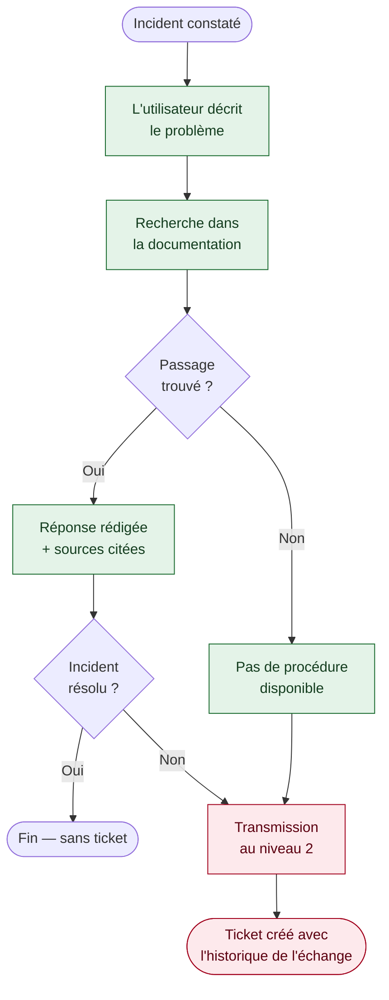

[← Accueil](README.md)

# 2. Description fonctionnelle

## 2.1 Expérience utilisateur visée

*À compléter.*

## 2.2 Parcours 1 — Résolution d'un incident

En vert, ce qui fonctionne dans le prototype 🟢. En rouge, l'escalade vers le niveau 2 🔴.

## 2.3 Parcours 2 — Recherche d'information sur l'offre

Ce parcours n'entre pas dans le MVP : il est ajouté en v2.
