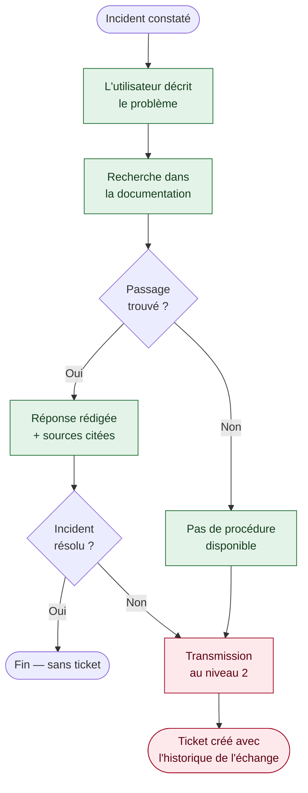
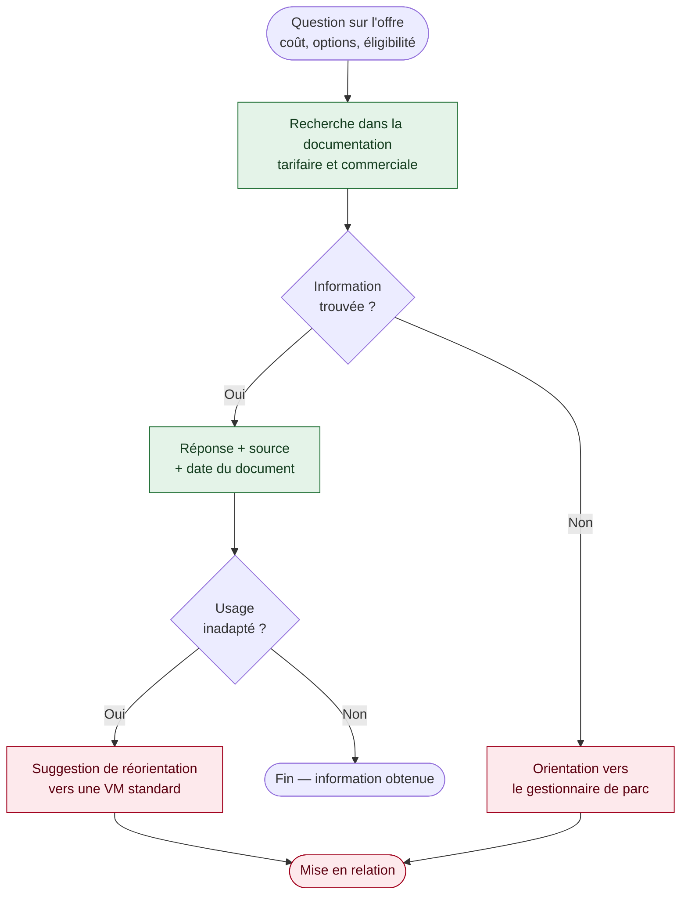

[← Accueil](README.md)

# 2. Description fonctionnelle

## 2.1 Expérience utilisateur visée

Du point de vue de l'utilisateur, le fonctionnement tient en quatre temps :

1. Il pose sa question en langage courant, sans mot-clé imposé ni formulaire à remplir.
2. Le système recherche d'abord les passages pertinents dans la documentation du service, puis rédige une réponse à partir de ces seuls passages.
3. La réponse s'affiche accompagnée de ses sources et d'un taux de correspondance — par exemple : documentation Diagnostic (95 %), FAQ (82 %), procédure ServiceNow (71 %).
4. Si le problème persiste, un ticket est ouvert vers un technicien de niveau 2.

### État des fonctionnalités

| Fonctionnalité | État |
|---|---|
| Saisie en langage naturel et réponse rédigée | 🟢 Vérifié |
| Recherche préalable dans la documentation | 🟢 Vérifié |
| Affichage des sources et du taux de correspondance | 🟢 Vérifié |
| Création automatique d'un ticket vers le niveau 2 | 🔴 À construire |
| Accès depuis Sharepoint de l'offre/Catalogue des services numériques | 🔴 À construire |

> **Le résultat attendu le plus discriminant est l'affichage des sources.** Un assistant qui répond sans justifier sa réponse n'est pas utilisable dans un contexte de support : l'utilisateur doit pouvoir vérifier d'où vient l'information, et le service doit pouvoir identifier une documentation obsolète. Cette exigence a orienté l'ensemble des choix techniques.

### Séquencement des deux usages

La résolution d'incident constitue seule le périmètre du MVP ; la recherche d'information sur l'offre est traitée dans un second temps. Deux raisons : la résolution d'incident concentre l'essentiel des pertes identifiées, et mener les deux usages de front rendrait impossible l'imputation des résultats.

## 2.2 Parcours 1 — Résolution d'un incident

Utilisateur type : Jeanne, usage quotidien d'une VM standard.

En vert, ce qui fonctionne dans le prototype 🟢. En rouge, l'escalade vers le niveau 2 🔴.

## 2.3 Parcours 2 — Recherche d'information sur l'offre

Utilisateur type : Louis, usage occasionnel d'une VM clone.

Ce parcours n'entre pas dans le MVP : il est ajouté en v2, une fois la résolution d'incident mesurée.
