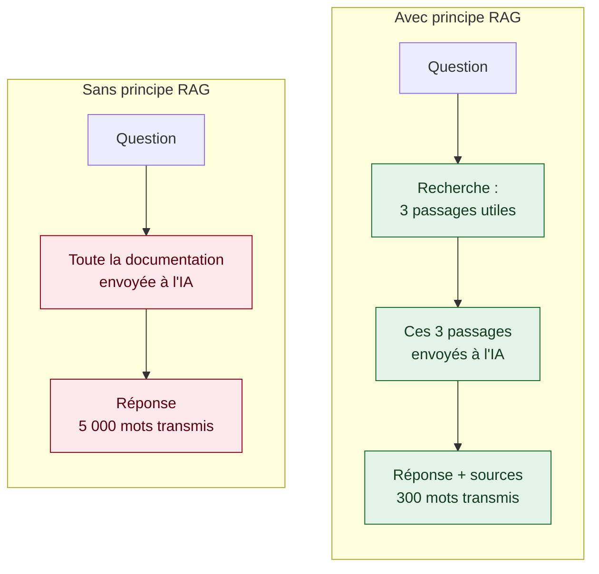
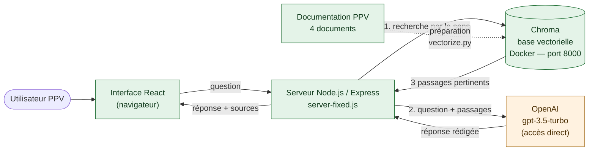
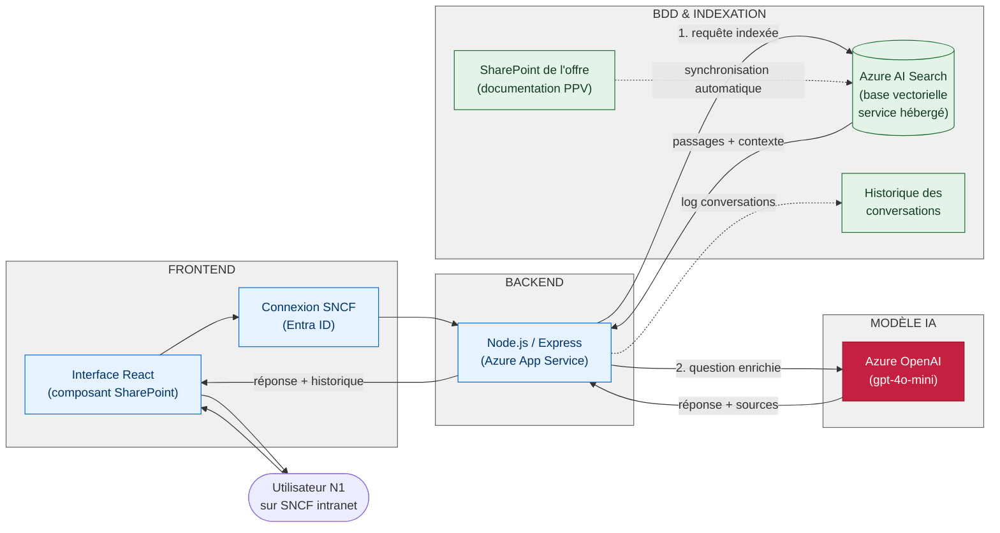
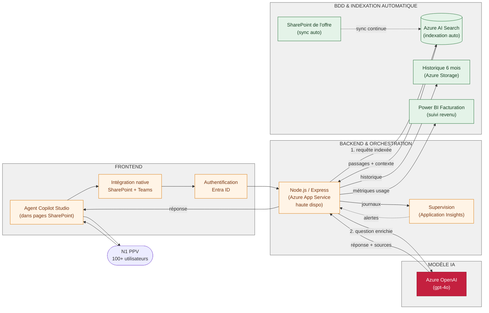

[← Accueil](README.md)

# 4. Architecture technique

## 4.1 Le principe retenu

Le coût par question passe de 0,05 € à 0,0003 € 🟡 — calcul à partir du volume transmis.

## 4.2 Les 3 états de l'architecture

L'architecture progresse en trois états reflétant les phases d'implémentation et les gains de maturité.

### 4.2.1 État 0 : Prototype (aujourd'hui)

Le prototype valide la faisabilité, intégralement exécuté en local.

**Caractéristiques** : Entièrement local (poste développeur), indexation manuelle, pas d'authentification, pas de journalisation.

**Avantages** : Rapidité de mise en œuvre, contrôle total, coût zéro infrastructure.

**Limites** : Pas de persistance, pas de multi-utilisateurs, infrastructure manuelle.

---

### 4.2.2 État 1 : MVP — Phase 1 de la cible

L'État 1 déploie la solution cible phase 1 auprès d'un groupe pilote d'utilisateurs N1.

**Caractéristiques** : Frontend React + SharePoint, authentification Entra ID, backend Azure App Service, documentation depuis SharePoint (sync auto), base vectorielle managée (Azure AI Search), Azure OpenAI, historique 6 mois, déploiement Git → Azure.

**Avantages** : Environnement Microsoft homogène, données UE, authentification unifiée, scalabilité horizontale, support infrastructure SNCF, multi-utilisateurs natif.

**Limites** : Copilot Studio pas encore intégré, indexation manuelle initialement, capacité limitée (phase pilote).

**Timeline** : 2-3 mois après approbation prototype.

---

### 4.2.3 État 2 : Production complète — Phase 2 de la cible

L'État 2 déploie la solution cible phase 2 à tous les N1 PPV avec automatisation et supervision.

**Caractéristiques** : Copilot Studio natif (pas de React à maintenir), intégration SharePoint/Teams, backend haute disponibilité, indexation entièrement automatique, suivi financier Power BI, supervision applicative (Application Insights), support 100+ N1 simultanés, gpt-4o optimisé.

**Avantages** : Zéro maintenance UI, automatisation complète, supervision proactive, ROI mesuré, scalabilité sans limite, support 24/7 SNCF.

**Limites** : Coût infrastructure élevé, dépendance Microsoft, changement paradigme pour N1.

**Timeline** : 6-9 mois après État 1 stabilisé.

---

### 4.2.4 Comparaison synthétique

| Dimension | Prototype | État 1 | État 2 |
|---|---|---|---|
| **Frontend** | React local | React + SharePoint | Copilot Studio natif |
| **Backend** | Node.js local | Azure App Service | App Service HA |
| **Stockage** | Chroma Docker local | Azure AI Search | Azure AI Search auto-indexé |
| **Authentification** | Aucune | Entra ID SNCF | Entra ID SNCF |
| **Modèle IA** | OpenAI direct | Azure OpenAI (gpt-4o-mini) | Azure OpenAI (gpt-4o) |
| **Historique** | Aucun | 6 mois conservé | 6 mois conservé + Power BI |
| **Supervision** | Aucune | Logs applicatifs | Application Insights complet |
| **Utilisateurs** | 1 (dev) | ~20 pilotes | 100+ en production |
| **Déploiement** | Docker local | Git → Azure | GitOps complet |
| **Coût infrastructure** | 0 € | ~2k€/mois | ~4k€/mois |
| **Durée déploiement** | 2 semaines | 2-3 mois | 6-9 mois |

---

## 4.3 Prototype et architecture cible détaillés

Même structure des deux côtés : seule change la nature de chaque brique. La pré-rédaction du ticket n'existe que dans la cible.

### Qui fait quoi dans l'architecture cible

Les trois briques Microsoft ont chacune un rôle distinct, et chacune remplace une brique du prototype :

| Rôle | Brique cible | Ce qu'elle fait | Équivalent dans le prototype |
|---|---|---|---|
| Le guichet | Copilot Studio | Fenêtre de conversation intégrée aux pages SharePoint ; connexion avec le compte SNCF | Interface React |
| Le documentaliste | Azure AI Search | Retrouve les passages utiles de la documentation, par le sens | Chroma |
| Le rédacteur | Azure OpenAI | Rédige la réponse à partir des seuls passages reçus, en citant ses sources | OpenAI en accès direct |

## 4.3 Les technologies, du prototype à la solution cible

| Besoin technique | Prototype de faisabilité (réalisé) 🟢 | Solution cible 🔴 | Raison du choix cible |
|---|---|---|---|
| Interface (la fenêtre de conversation) | React (JavaScript), dans le navigateur | Phase 1 : composant React intégré aux pages SharePoint · Phase 2 : agent Copilot Studio | Accès depuis le SharePoint de l'offre et le catalogue ; en phase 2, un outil Microsoft prêt à l'emploi, plus simple à maintenir |
| Orchestrer la recherche puis la rédaction | Node.js / Express (JavaScript), sur le poste | Node.js / Express, hébergé sur Azure App Service | Même code que le prototype, hébergé et supervisé dans l'environnement de l'entreprise |
| Découper et indexer la documentation | Script Python, lancé à la main sur 4 documents | Phase 1 : bibliothèque SharePoint interrogée directement · Phase 2 : indexation automatique dans Azure AI Search | Documentation réelle du service, mise à jour sans intervention manuelle |
| Recherche par le sens | Chroma (base locale, mesure « cosinus ») | Azure AI Search | Service hébergé, sauvegardé et intégré à l'écosystème Microsoft ([benchmark](03-benchmark.md)) |
| Traduire le texte en nombres (vectorisation) | text-embedding-3-small, via OpenAI en direct | Même modèle, via Azure OpenAI | Données traitées dans l'environnement de l'entreprise, en région UE |
| Rédiger la réponse | gpt-3.5-turbo, via OpenAI en direct | Modèle plus récent (gpt-4o-mini), via Azure OpenAI | Meilleure qualité en français, données traitées dans l'environnement de l'entreprise ([benchmark](03-benchmark.md)) |
| Connexion des utilisateurs | Aucune | Microsoft Entra ID (compte SNCF) | Authentification unique, déjà utilisée par la SNCF |
| Journalisation | Aucune | Interne SNCF, conservation 6 mois | Traçabilité et conformité RGPD |
| Outillage | Docker, Git / GitHub | Git / GitHub, déploiement sur Azure | Historique du code et support des revues |
| Langages | JavaScript, Python | JavaScript, Python | Les mêmes : le code du prototype est réutilisé |

**Les langages ne changent pas** : seuls les services qui entourent le code sont remplacés par leur équivalent Microsoft. C'est ce qui fait du prototype une base réutilisable, et non une maquette jetable.

> Le prototype fonctionne avec OpenAI en accès direct, alors que l'architecture préconisée retient Azure OpenAI. Cet écart s'explique par l'absence d'accès Azure dans le cadre de l'alternance ; la brique testée est identique dans les deux cas.

## 4.4 Écarts entre Prototype et Architecture cible (État 1 & 2)

### Raisons des écarts

| Écart | Prototype | Cible (État 1+) | Justification |
|---|---|---|---|
| **Lieu d'exécution** | Local (poste dev) | Cloud (Azure) | Infrastructure d'entreprise, pas de machine locale requise pour les N1 |
| **Authentification** | Aucune | Entra ID SNCF | Traçabilité légale et conformité RGPD (qui a posé quelle question ?) |
| **Documentation source** | 4 fichiers manuels | SharePoint officiel de l'offre | Source unique de vérité, mise à jour centralisée |
| **Indexation** | Script Python manuel | Automatique (Azure) | Scalabilité : indexer automatiquement 2500 VM chaque jour |
| **Base vectorielle** | Chroma (locale) | Azure AI Search | Service managé, pas de maintenance, backup automatique |
| **Historique** | Aucun | 6 mois conservé | RGPD + amélioration du modèle IA par feedback |
| **Modèle IA** | OpenAI direct | Azure OpenAI | Données UE, région compliant SNCF, facturation centralisée |
| **Supervision** | Aucune | Application Insights (État 1) / Complète (État 2) | Détection proactive des défaillances, alertes |
| **UI maintenance** | React (alternant) | Copilot Studio (aucune) en État 2 | Copilot Studio = outil Microsoft prêt à l'emploi, moins de code à maintenir |

### Risques d'écart et mitigations

**Risque** : Données OpenAI vs Azure OpenAI diffèrent légèrement → Réponses IA divergentes
- **Mitigation** : Benchmark des deux services (cf. [03-benchmark.md](03-benchmark.md)) ; Azure OpenAI + modèle gpt-4o-mini est validé en français

**Risque** : SharePoint moins rapide que 4 fichiers indexés
- **Mitigation** : Azure AI Search inclut caching et optimisation requête ; tests de charge en État 1

**Risque** : Copilot Studio impose UX différente (État 2)
- **Mitigation** : Formation N1 et démonstration prototype d'ici État 1 ; feedback avant État 2

## 4.5 Points de validation critiques

### Pour État 1 (MVP) :
1. ✓ Azure OpenAI + gpt-4o-mini en français = qualité ≥ prototype
2. ✓ Azure AI Search retrouve les 3 passages utiles en < 500ms
3. ✓ Entra ID et SharePoint synchronisés
4. ✓ Support < 2s pour N1 pilotes

### Pour État 2 (Production) :
1. ✓ Copilot Studio stable à 100+ N1 simultanés
2. ✓ Indexation automatique ne casse rien
3. ✓ Application Insights détecte défaillances
4. ✓ Power BI suit revenu additionnel (15k€/an réalisés)
