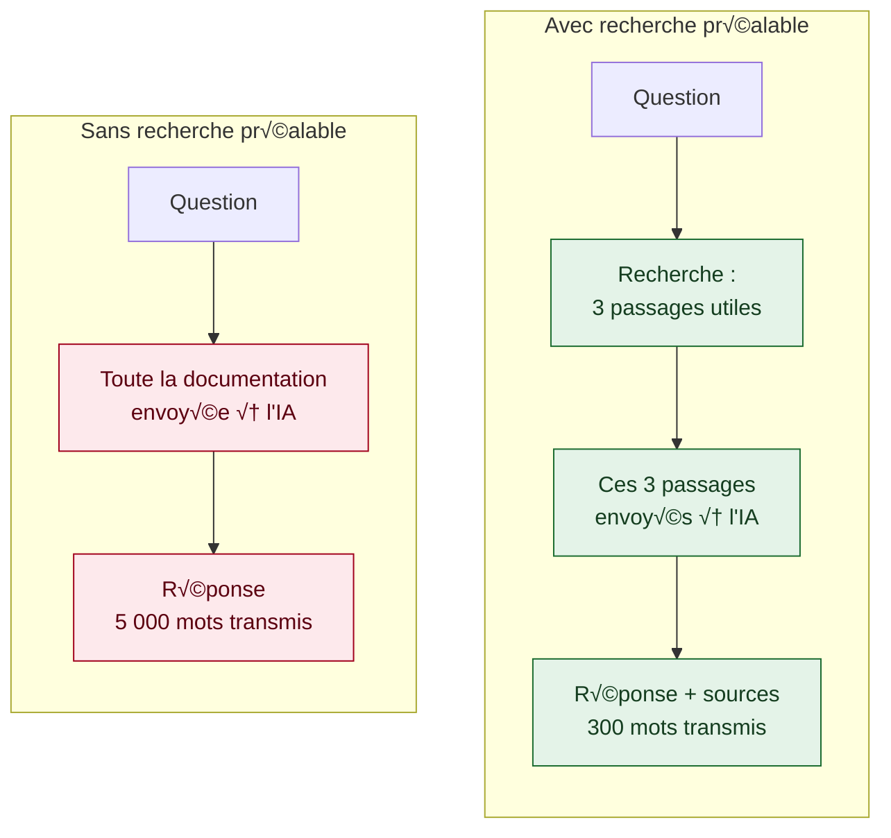
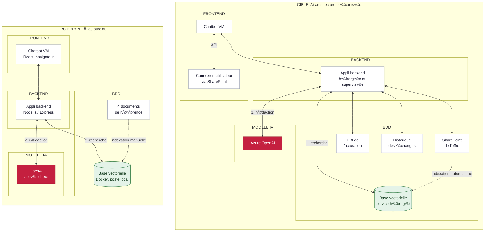

[‚Üê Accueil](README.md)

# 4. Architecture technique

## 4.1 Le principe retenu

Le coût par question passe de 0,05 € à 0,0003 € 🟡 — calcul à partir du volume transmis.

## 4.2 Prototype et architecture cible

M™me structure des deux c√¥t√©s : seule change la nature de chaque brique. La cr√©ation de ticket n'existe que dans la cible.

## 4.3 Les technologies, par couche

| Couche | Technologie | Type | Rôle |
|---|---|---|---|
| Interface | React | Bibliothèque d'interface | Les écrans affichés dans le navigateur |
| Serveur | Node.js / Express | Environnement d'exécution et cadre serveur | Reçoit la question, orchestre, renvoie la réponse |
| Recherche | Chroma | Base de données vectorielle | Recherche par le sens et non par mots-clés |
| Recherche | Python | Langage de programmation | Préparation et indexation des documents |
| IA | text-embedding-3-small | Modèle de vectorisation | Traduit un texte en nombres représentant son sens |
| IA | gpt-3.5-turbo | Grand modèle de langage | Rédige la réponse à partir des passages reçus |
| Outillage | Docker | Conteneurisation | Environnement reproductible |
| Outillage | Git / GitHub | Gestion de versions | Historique du code et support des relectures |

> Le prototype fonctionne avec OpenAI en accès direct, alors que l'architecture préconisée retient Azure OpenAI. Cet écart s'explique par l'absence d'accès Azure dans le cadre de l'alternance ; la brique testée est identique dans les deux cas.
