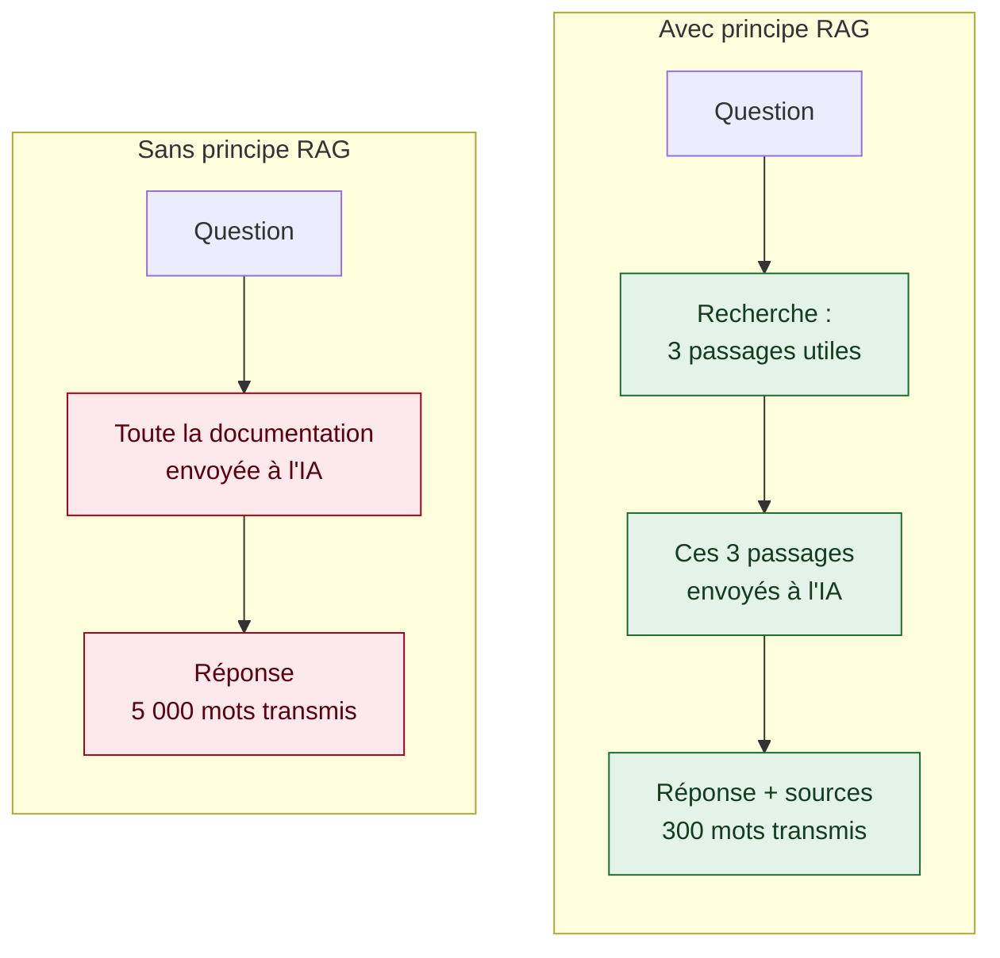
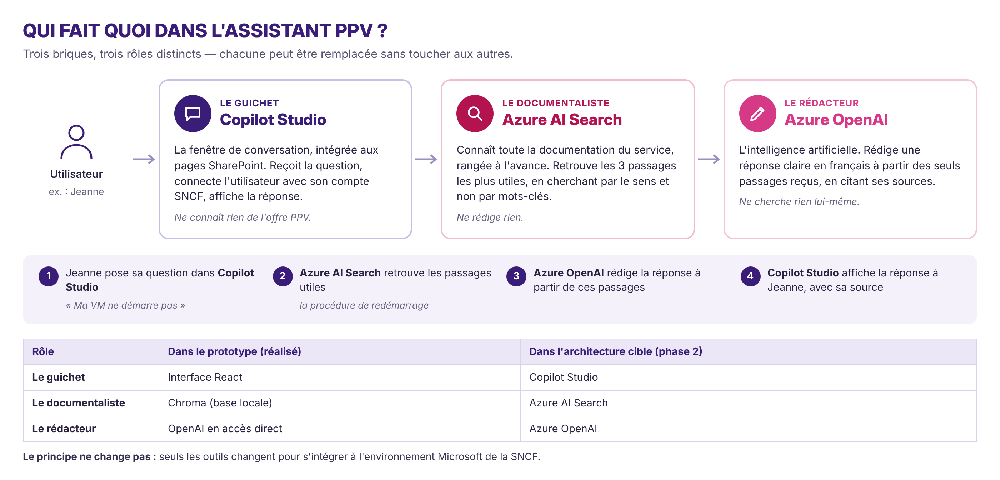

[← Accueil](README.md)

# 4. Architecture technique

## 4.1 Le principe retenu

Le coût par question passe de 0,05 € à 0,0003 € 🟡 — calcul à partir du volume transmis.

## 4.2 Prototype et architecture cible

Même structure des deux côtés : seule change la nature de chaque brique. La pré-rédaction du ticket n'existe que dans la cible.

### Qui fait quoi dans l'architecture cible

Les trois briques Microsoft ont chacune un rôle distinct, et chacune remplace une brique du prototype :

| Rôle | Brique cible | Ce qu'elle fait | Équivalent dans le prototype |
|---|---|---|---|
| Le guichet | Copilot Studio | Fenêtre de conversation intégrée aux pages SharePoint ; connexion avec le compte SNCF | Interface React |
| Le documentaliste | Azure AI Search | Retrouve les passages utiles de la documentation, par le sens | Chroma |
| Le rédacteur | Azure OpenAI | Rédige la réponse à partir des seuls passages reçus, en citant ses sources | OpenAI en accès direct |

## 4.3 Les technologies, du prototype à la solution cible

| Besoin technique | Prototype de faisabilité (réalisé) 🟢 | Solution cible 🔴 | Raison du choix cible |
|---|---|---|---|
| Interface (la fenêtre de conversation) | React (JavaScript), dans le navigateur | Phase 1 : composant React intégré aux pages SharePoint · Phase 2 : agent Copilot Studio | Accès depuis le SharePoint de l'offre et le catalogue ; en phase 2, un outil Microsoft prêt à l'emploi, plus simple à maintenir |
| Orchestrer la recherche puis la rédaction | Node.js / Express (JavaScript), sur le poste | Node.js / Express, hébergé sur Azure App Service | Même code que le prototype, hébergé et supervisé dans l'environnement de l'entreprise |
| Découper et indexer la documentation | Script Python, lancé à la main sur 4 documents | Phase 1 : bibliothèque SharePoint interrogée directement · Phase 2 : indexation automatique dans Azure AI Search | Documentation réelle du service, mise à jour sans intervention manuelle |
| Recherche par le sens | Chroma (base locale, mesure « cosinus ») | Azure AI Search | Service hébergé, sauvegardé et intégré à l'écosystème Microsoft ([benchmark](03-benchmark.md)) |
| Traduire le texte en nombres (vectorisation) | text-embedding-3-small, via OpenAI en direct | Même modèle, via Azure OpenAI | Données traitées dans l'environnement de l'entreprise, en région UE |
| Rédiger la réponse | gpt-3.5-turbo, via OpenAI en direct | Modèle plus récent (gpt-4o-mini), via Azure OpenAI | Meilleure qualité en français, données traitées dans l'environnement de l'entreprise ([benchmark](03-benchmark.md)) |
| Connexion des utilisateurs | Aucune | Microsoft Entra ID (compte SNCF) | Authentification unique, déjà utilisée par la SNCF |
| Journalisation | Aucune | Interne SNCF, conservation 6 mois | Traçabilité et conformité RGPD |
| Outillage | Docker, Git / GitHub | Git / GitHub, déploiement sur Azure | Historique du code et support des revues |
| Langages | JavaScript, Python | JavaScript, Python | Les mêmes : le code du prototype est réutilisé |

**Les langages ne changent pas** : seuls les services qui entourent le code sont remplacés par leur équivalent Microsoft. C'est ce qui fait du prototype une base réutilisable, et non une maquette jetable.

> Le prototype fonctionne avec OpenAI en accès direct, alors que l'architecture préconisée retient Azure OpenAI. Cet écart s'explique par l'absence d'accès Azure dans le cadre de l'alternance ; la brique testée est identique dans les deux cas.
