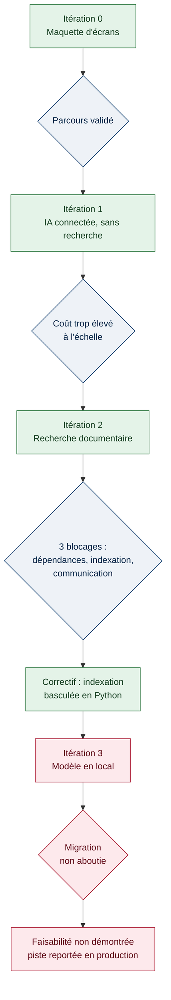

[← Accueil](README.md)

# 6. Prototypage et itérations

Le prototype s'est construit en quatre itérations, chacune déclenchée par la limite constatée à l'itération précédente.

## 6.1 Découpage et description des itérations

### Itération 0 — Valider le parcours avant d'engager la technique

| | |
|---|---|
| **Objectif** | Vérifier la pertinence du parcours utilisateur sans écrire de code d'intelligence artificielle |
| **Réalisation** | Maquette d'écrans couvrant le diagnostic d'incident, la création de ticket, la FAQ, la grille tarifaire et un tableau de bord |
| **Résultat** | Le parcours tient, les écrans sont validés |
| **Analyse** | Rien ne prouve en revanche que le traitement puisse être réalisé à un coût acceptable. Le risque n'est pas fonctionnel, il est technique |
| **Correctif** | Engager une itération avec une IA réellement connectée |

### Itération 1 — Connecter une IA, sans recherche documentaire

| | |
|---|---|
| **Objectif** | Obtenir des réponses réelles, en interrogeant directement l'IA |
| **Réalisation** | Chaîne complète écrans / serveur / IA opérationnelle |
| **Résultat** | Le système répond, mais chaque question suppose de transmettre un volume documentaire important : environ 0,05 € par question et une dizaine de secondes d'attente 🟡 |
| **Analyse** | À l'échelle de 2 000 utilisateurs, ce coût interdit toute mise en service. La limite n'est pas la qualité des réponses, c'est le modèle économique |
| **Correctif** | Introduire une recherche documentaire préalable |

### Itération 2 — Mettre en place la recherche documentaire

| | |
|---|---|
| **Objectif** | Interposer une base de recherche entre la question et l'IA |
| **Réalisation** | Base de recherche lancée en conteneur, documents découpés et indexés, serveur adapté pour enchaîner recherche puis rédaction |
| **Résultat** | Trois obstacles successifs : conflits de dépendances bloquant l'installation ; échec répété de l'étape de découpage et d'indexation en JavaScript ; absence de communication entre les écrans et le serveur |
| **Analyse** | Le premier obstacle relève de l'intégration courante. Le deuxième est structurel : la bibliothèque d'orchestration n'était pas stable dans sa version JavaScript pour cet usage. Le troisième a été isolé par lecture de la console du navigateur |
| **Correctif** | Installation forcée en mode de compatibilité ; **bascule de la préparation documentaire vers Python**, qui a débloqué la situation ; correction de l'appel côté écran. Le prototype fonctionne depuis : 4 documents indexés en 128 morceaux 🟢 |

### Itération 3 — Tenter de s'affranchir du fournisseur externe

| | |
|---|---|
| **Objectif** | Faire fonctionner localement le modèle de vectorisation, pour ne plus dépendre d'un service externe |
| **Réalisation** | Trois fichiers créés pour un modèle multilingue exécuté en local : serveur de vectorisation, script de préparation adapté, serveur applicatif adapté |
| **Résultat** | **Migration non aboutie.** La version en service reste celle fondée sur le fournisseur externe |
| **Analyse** | Complexité sous-estimée : l'exécution locale suppose de faire coexister deux environnements techniques distincts sur une même machine. L'effort dépassait le cadre du prototype, pour un gain marginal sur le poste le moins coûteux de la chaîne |
| **Correctif** | Piste abandonnée pour le prototype, réinscrite comme option à étudier en production, où elle prend son sens pour des raisons de conformité davantage que de coût |

## 6.2 Résultats et statut des indicateurs

| Indicateur | Valeur | Statut | Fondement |
|---|---|---|---|
| Coût par question | 0,05 € sans recherche, 0,0003 € avec | 🟡 Estimé | Calcul à partir du volume transmis et du tarif public au million de mots |
| Temps de réponse | ≈ 10 s sans recherche, < 1 s avec | 🟡 Estimé | Ordre de grandeur constaté, sans protocole de chronométrage |
| Pertinence des réponses | Objectif visé : 95 % | 🔴 À mesurer | Valeur issue de la documentation de conception, non d'un test |
| Indexation documentaire | 4 documents, 128 morceaux | 🟢 Vérifié | Constaté à l'exécution du script de préparation |

**Protocole de mesure à mettre en place.** Un jeu d'évaluation d'une trentaine de questions de support représentatives, chacune assortie de la réponse attendue. Les réponses de l'assistant sont confrontées à cette référence et classées en trois catégories : exacte, incomplète, erronée. Le protocole est reproductible, et le résultat devient opposable. Les 30 questions, issues des 30 dernières demandes au support, sont détaillées dans le [jeu d'évaluation](15-jeu-evaluation.md).

## 6.3 Normes de qualité et de performance

| Norme retenue | Seuil | Suivi |
|---|---|---|
| Temps de réponse perçu | Moins de 2 secondes | 🔴 À instrumenter |
| Traçabilité des réponses | Toute réponse cite ses sources | 🟢 Vérifié |
| Confidentialité | Aucune clé d'accès dans le dépôt | 🟢 Vérifié |
| Coût unitaire | Moins de 0,001 € par question | 🟡 Estimé |

## 6.4 Faisabilité non démontrée : un résultat en soi

L'itération 3 constitue une non-faisabilité constatée dans les conditions du prototype. Elle est documentée au même titre que les itérations réussies : les fichiers produits subsistent dans le dépôt et attestent de la tentative.

Les attendus du bloc demandent explicitement de démontrer la faisabilité **ou non** des briques les plus complexes. Une piste écartée pour des raisons argumentées constitue à ce titre un résultat de prototypage, et non un échec de projet.
