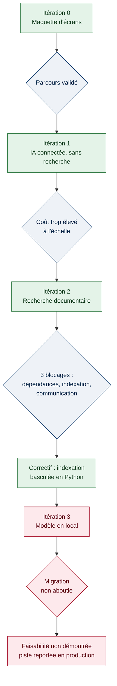

[← Accueil](README.md)

# 6. Prototypage et itérations

## 6.1 Découpage des itérations

## 6.2 Résultats et statut des indicateurs

| Indicateur | Valeur | Statut |
|---|---|---|
| Coût par question | 0,05 € sans recherche, 0,0003 € avec | 🟡 Estimé |
| Temps de réponse | ≈ 10 s sans recherche, < 1 s avec | 🟡 Estimé |
| Pertinence des réponses | Objectif visé : 95 % | 🔴 À mesurer |
| Indexation documentaire | 4 documents, 128 morceaux | 🟢 Vérifié |

## 6.3 Faisabilité non démontrée

L'itération 3 constitue une non-faisabilité constatée dans les conditions du prototype. Les attendus du bloc demandent de démontrer la faisabilité **ou non** des briques les plus complexes : une piste écartée pour des raisons argumentées est un résultat de prototypage, pas un échec de projet.
