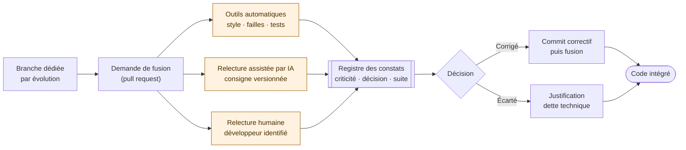
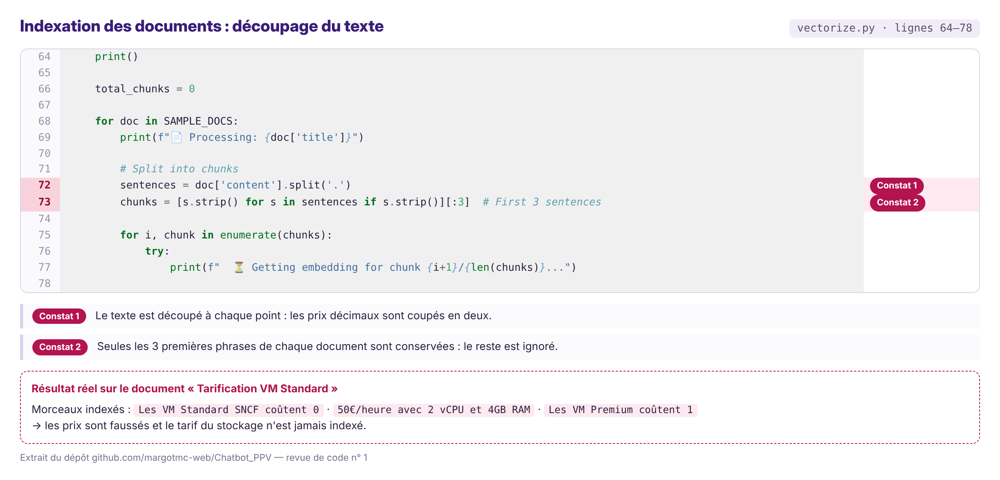
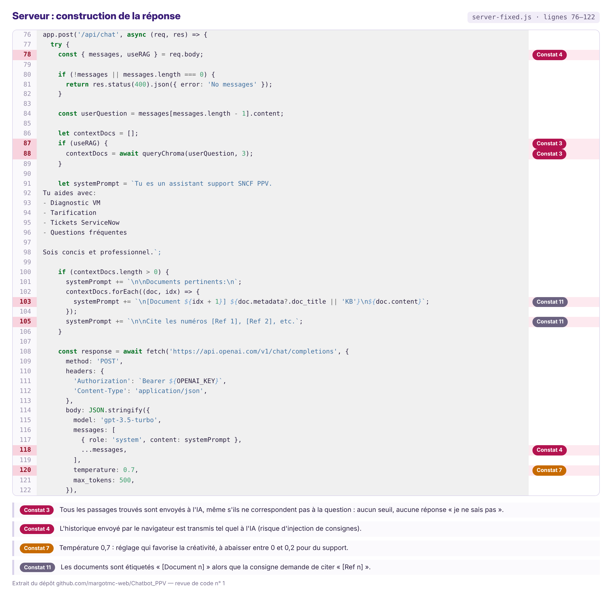
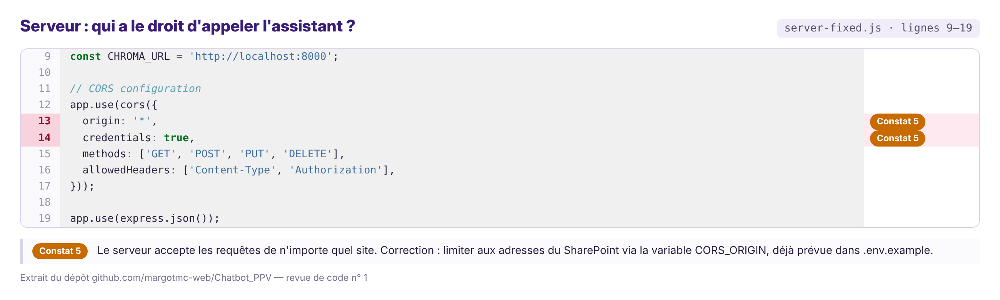
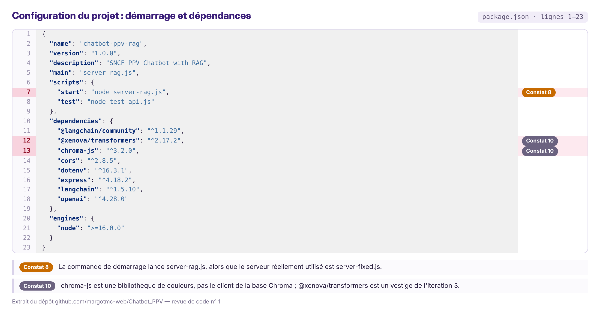

[← Accueil](README.md)

# 7. Revue de code

## 7.1 Processus retenu

## 7.2 Outils et périodicité

| Élément | Choix |
|---|---|
| Outils automatiques | ESLint (JavaScript), Ruff (Python), npm audit (vulnérabilités des dépendances), analyse des secrets GitHub, tests |
| Relecture assistée par IA | SonarQube Community (gratuit), GitHub CodeQL (gratuit) ; consigne versionnée dans le dépôt |
| Relecture humaine | Développeur identifié |
| Périodicité | À chaque demande de fusion, plus une revue collective de 30 min en fin de sprint |

## 7.3 Grille de relecture

Sept critères arrêtés avant la première revue, notés de 0 (non conforme) à 2 (conforme).

## 7.4 Revue n° 1 — Traitement d'une question

Périmètre : `server-fixed.js` (serveur en service), `vectorize.py` (indexation), `rag-service.js` (module de recherche), `package.json` (dépendances).

| Critère | Note | Justification |
|---|---|---|
| Lisibilité et nommage | 1 | Code commenté et structuré ; mais quatre versions du serveur et cinq scripts d'indexation coexistent |
| Gestion des erreurs | 1 | Erreurs interceptées, mais ni délai maximal ni nouvelle tentative sur les appels à l'IA |
| Protection des clés d'accès | 2 | Variables d'environnement, `.env` exclu du dépôt, `.env.example` sans clé réelle |
| Couverture de tests | 1 | Les routes de l'API sont testées, ni la recherche ni les cas limites |
| Temps de réponse | 1 | Contexte limité à 3 passages, mais aucun délai maximal sur les appels externes |
| Sécurité | 0 | Requêtes acceptées depuis n'importe quel site ; messages du navigateur transmis sans contrôle |
| Conformité RGPD | 1 | Aucune conversation stockée ; questions envoyées à OpenAI en accès direct (choix assumé du prototype) |
| **Total** | **7 / 14** | Faisabilité démontrée, corrections nécessaires avant la bêta |

## 7.5 Constats détaillés

Les constats sont présentés par partie du code relue. Chaque capture est un extrait réel du dépôt [Chatbot_PPV](https://github.com/margotmc-web/Chatbot_PPV) : les lignes en cause sont surlignées et portent le numéro du constat. Les numéros renvoient au registre récapitulatif (7.6).

### Indexation des documents — constats 1 et 2 (criticité haute)

Avant de pouvoir répondre, l'assistant découpe la documentation en morceaux et les range dans la base de recherche. La revue montre que ce découpage fausse les données :

- **Constat 1** — le texte est coupé à chaque point. Or les prix s'écrivent avec un point (« 0.50€ ») : ils sont donc coupés en deux, et l'IA reçoit des tarifs faux.
- **Constat 2** — seules les 3 premières phrases de chaque document sont conservées ; le reste de la documentation n'est jamais indexé.

Le test sur le document de tarification le confirme : le tarif du stockage n'est jamais indexé, et les prix des VM Standard et Premium sont tronqués. **Action** : découper par taille (1 000 caractères, avec un chevauchement de 200), comme prévu dans le [diagramme de classes](10bis-diagramme-classes.md).

### Construction de la réponse — constats 3, 4, 7 et 11

C'est le cœur de l'assistant : il assemble la question, les passages trouvés et une consigne, puis interroge l'IA.

- **Constat 3 (haute)** — tous les passages trouvés sont envoyés à l'IA, même s'ils ne correspondent pas à la question. Aucun seuil n'est appliqué et la consigne ne demande pas de refuser de répondre : l'assistant peut donc inventer une procédure.
- **Constat 4 (haute)** — l'historique envoyé par le navigateur est transmis tel quel à l'IA. Un utilisateur malveillant pourrait y glisser de fausses consignes.
- **Constat 7 (moyenne)** — la température, réglage qui dose la créativité de l'IA, est à 0,7 : trop élevée pour une réponse de support qui doit rester factuelle.
- **Constat 11 (faible)** — les documents sont étiquetés « [Document n] » alors que la consigne demande de citer « [Ref n] ».

**Actions** : appliquer un seuil de pertinence et une réponse « je ne sais pas » ; ne transmettre que les messages de l'utilisateur et de l'assistant ; abaisser la température entre 0 et 0,2 ; harmoniser les libellés.

### Accès au serveur — constat 5 (criticité moyenne)

- **Constat 5** — le serveur accepte les requêtes venant de n'importe quel site. Sans gravité tant que le prototype reste sur un poste local, ce réglage deviendrait une faille dès l'ouverture à des utilisateurs.

**Action** : limiter l'accès aux adresses du SharePoint, via la variable `CORS_ORIGIN` déjà prévue dans `.env.example`.

### Configuration du projet — constats 8 et 10

- **Constat 8 (moyenne)** — la commande de démarrage lance `server-rag.js`, alors que le serveur réellement utilisé est `server-fixed.js`. Deux chaînes de traitement coexistent, avec des noms de collection différents.
- **Constat 10 (faible)** — `chroma-js` est une bibliothèque de couleurs, et non le client de la base Chroma ; `@xenova/transformers` est un vestige de l'itération 3.

**Actions** : ne garder qu'une chaîne, supprimer les fichiers obsolètes, retirer les dépendances inutiles.

### Autres constats — 6, 9 et 12

- **Constat 6 (moyenne)** — aucun délai maximal ni nouvelle tentative sur les appels à l'IA, alors que le [diagramme de séquence](11-diagramme-sequence.md) les prévoit.
- **Constat 9 (moyenne)** — le score renvoyé par la base est une distance (plus elle est petite, plus le passage est proche), mais il est affiché comme un pourcentage de correspondance.
- **Constat 12 (faible)** — les messages d'erreur internes sont renvoyés au navigateur, et l'absence de clé d'accès n'est pas vérifiée au démarrage.

## 7.6 Registre récapitulatif des constats

| N° | Élément | Criticité | Constat | Action recommandée | Décision |
|---|---|---|---|---|---|
| 1 | `vectorize.py` | Haute | Découpage à chaque point : les prix décimaux sont coupés (« 0.50€ » → « coûtent 0 » / « 50€/heure ») | Découpage par taille (1 000 caractères, chevauchement 200) | À corriger avant la bêta |
| 2 | `vectorize.py` | Haute | Seules les 3 premières phrases de chaque document sont indexées | Supprimer la limite | À corriger avant la bêta |
| 3 | `server-fixed.js` | Haute | Aucun seuil de pertinence ; la consigne ne demande pas de refuser sans passage pertinent | Seuil + réponse « je ne sais pas » + consigne « uniquement à partir des documents » | À corriger avant la bêta |
| 4 | `server-fixed.js` | Haute | Historique du navigateur transmis tel quel à l'IA (risque d'injection de consignes) | Ne garder que les rôles utilisateur et assistant, limiter la longueur | À corriger avant la bêta |
| 5 | `server-fixed.js` | Moyenne | Requêtes acceptées depuis n'importe quel site (`origin: '*'`) | Restreindre via `CORS_ORIGIN` | Accepté en local, à corriger avant la bêta |
| 6 | `server-fixed.js` | Moyenne | Pas de délai maximal ni de nouvelle tentative, contrairement au diagramme de séquence | Délai 10 s, une nouvelle tentative après 2 s, puis passages bruts | À corriger |
| 7 | `server-fixed.js` | Moyenne | Température 0,7, trop créative pour du support | Abaisser entre 0 et 0,2 | À corriger |
| 8 | `package.json` | Moyenne | `npm start` lance `server-rag.js` (syntaxe `import` non reconnue) ; deux chaînes avec des collections différentes (`ppv` / `ppv_documents`) | Une seule chaîne, fichiers obsolètes supprimés | À corriger |
| 9 | `rag-service.js` | Moyenne | Distance Chroma affichée comme pourcentage de correspondance | Convertir en similarité (1 − distance) | À vérifier puis corriger |
| 10 | `package.json` | Faible | `chroma-js` est une bibliothèque de couleurs ; `@xenova/transformers` est un vestige de l'itération 3 | Retirer ces dépendances | À corriger |
| 11 | `server-fixed.js` | Faible | Consigne « [Ref 1] » vs documents étiquetés « [Document 1] » | Harmoniser | À corriger |
| 12 | `server-fixed.js` | Faible | Erreurs internes renvoyées au navigateur ; clé non vérifiée au démarrage | Message générique, contrôle au démarrage | Dette technique (v1) |

## 7.8 Intégration au planning

La relecture de code est intégrée à chaque sprint de développement :

| Phase | Sprints | Relecture | Durée |
|---|---|---|---|
| MVP | S3, S4, S5 | Relecture croisée en fin de sprint | 3 h/sprint |
| Post-MVP | S13, S14, S15 | Relecture croisée en fin de sprint | 3 h/sprint |

Cette relecture fait partie de la cérémonie de fin de sprint (revue + rétrospective) et s'effectue de manière asynchrone ou lors de la réunion d'équipe existante. Elle n'ajoute pas de surcoût au planning global.

## 7.7 Retours au développeur

- **Points forts** : séparation claire recherche / contexte / rédaction ; clés protégées ; code commenté ; supervision (`/api/health`) et script de test en place.
- **Points d'amélioration** : fiabiliser l'indexation (constats 1-2) ; empêcher toute réponse sans source pertinente (3) ; sécuriser les entrées (4-5).
- **Priorité du premier sprint de bêta** : constats 1 à 5.
- **Bonne pratique** : un test automatique par constat corrigé (ex. : un prix décimal reste intact après indexation).
