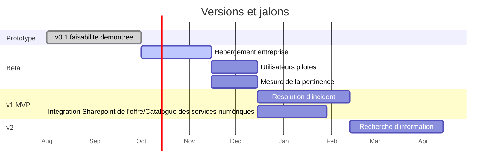

[← Accueil](README.md)

# 8. Plan de release

## 8.1 Versions et critères de passage

| Version | Périmètre | Période | Effort de développement | Condition de passage | Statut |
|---|---|---|---|---|---|
| v0.1 — Prototype | 4 documents, un utilisateur, exécution locale | Août – octobre 2026 | Réalisé hors budget projet | Faisabilité démontrée | 🟢 Vérifié |
| Bêta | Hébergement entreprise, documentation réelle, réponse « je ne sais pas », pré-rédaction du ticket ; 10 à 15 utilisateurs pilotes | S1 – S8 | ≈ 16 j (environnements 3 j + 3 sprints de 4,2 j) | 80 % des scénarios de test réussis, aucune réponse inventée | 🔴 À construire |
| v1 — MVP | Résolution d'incident, accès SharePoint de l'offre / Catalogue des services numériques, authentification Entra ID | S9 – S10 | ≈ 2 j (corrections, sécurité) | Conformité RGPD et sécurité validées, GO du commanditaire | 🔴 À construire |
| v2 | Recherche d'information sur l'offre, agent Copilot Studio, Azure AI Search, indexation automatique, journalisation 6 mois | S11 – S20 | ≈ 17 j (environnements 2 j + 3 sprints de 4,5 j + sécurité) | Tests de charge réussis, baisse mesurée des sollicitations N1 | 🔴 À construire |

Les semaines S1 à S20 renvoient au planning du projet (dossier principal, Bloc 3). L'effort total (≈ 35 jours) correspond au budget de développement.

**Marges de manœuvre** : environ 10 % de capacité non planifiée par sprint ; fonctionnalités « pourrait avoir » reportables en priorité ; jalons GO/NOGO en S1, S10 et S20 ; contingence budgétaire de 10 %.

## 8.2 Calendrier

Dates à ajuster.
