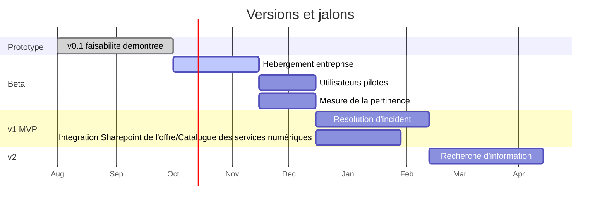

[← Accueil](README.md)

# 8. Plan de release

## 8.1 Versions et critères de passage

| Version | Périmètre | Condition de passage | Statut |
|---|---|---|---|
| v0.1 — Prototype | 4 documents, un utilisateur, exécution locale | Faisabilité démontrée | 🟢 Vérifié |
| Bêta | 10 à 15 utilisateurs pilotes, hébergement entreprise | Pertinence mesurée | 🔴 À construire |
| v1 — MVP | Résolution d'incident, accès Sharepoint de l'offre/Catalogue des services numériques, ticket automatique | Baisse des sollicitations N1 | 🔴 À construire |
| v2 | Recherche d'information sur l'offre | — | 🔴 À construire |

## 8.2 Calendrier

Dates à ajuster.
