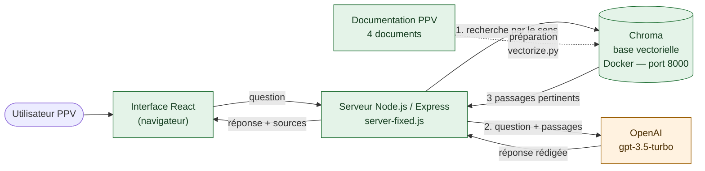

## Architecture technique

```mermaid
flowchart LR
    U([Utilisateur PPV]) --> F["Interface React<br/>(navigateur)"]
    F -->|question| S["Serveur Node.js / Express<br/>server-fixed.js"]
    S -->|1. recherche par le sens| C[("Chroma<br/>base vectorielle<br/>Docker — port 8000")]
    C -->|3 passages pertinents| S
    S -->|2. question + passages| L["OpenAI<br/>gpt-3.5-turbo"]
    L -->|réponse rédigée| S
    S -->|réponse + sources| F
    D["Documentation PPV<br/>4 documents"] -.->|préparation<br/>vectorize.py| C

    classDef proto fill:#e4f3e8,stroke:#1a6b2f,color:#143d1f;
    classDef ext fill:#fff2e0,stroke:#9a5c00,color:#4a2d00;
    class F,S,C,D proto
    class L ext
```

*En vert : les briques exécutées localement. En orange : le service externe.*
