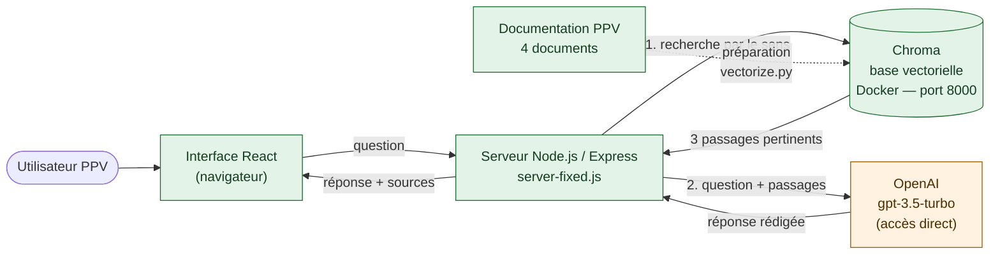
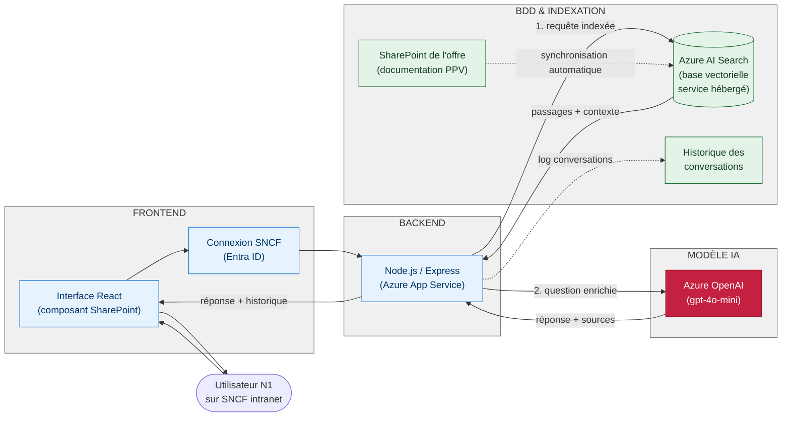
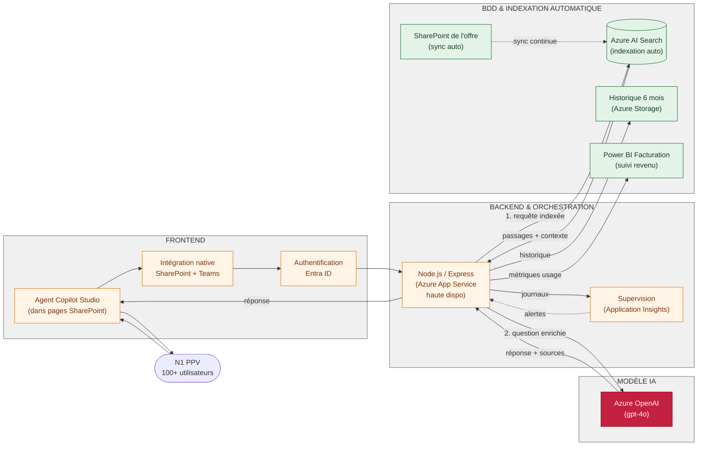

## Architecture technique du Chatbot PPV

### Panorama : les 3 états de l'architecture

L'architecture du chatbot suit une progression en 3 états qui reflète les phases d'implémentation et les gains de maturité :

- **État 0 (Prototype)** : Faisabilité validée localement
- **État 1 (MVP)** : Solution cible phase 1 — déploiement pilote auprès des N1 SNCF
- **État 2 (Production)** : Solution cible phase 2 — déploiement complet avec intégration Copilot Studio et automatisation

---

## État 0 : Prototype (aujourd'hui)

Le prototype est construit pour valider la faisabilité, intégralement exécuté en local.

**Caractéristiques** :
- Entièrement local (poste développeur)
- Indexation manuelle des 4 documents
- Pas d'authentification
- Pas de journalisation
- Réponse directe en temps réel

**Avantages** : Rapidité de mise en œuvre, contrôle total, coût zéro infrastructure

**Limites** : Pas de persistance, pas de multi-utilisateurs, infrastructure manuelle

---

## État 1 : MVP — Phase 1 de la cible

L'État 1 déploie la solution cible phase 1 auprès d'un groupe pilote d'utilisateurs N1.

**Caractéristiques** :
- Frontend React intégré à SharePoint
- Authentification via Entra ID (compte SNCF)
- Backend hébergé sur Azure App Service
- Documentation depuis SharePoint (synchronisation automatique)
- Base vectorielle managée (Azure AI Search)
- Modèle IA via Azure OpenAI
- Historique des conversations conservé 6 mois
- Déploiement via Git / GitHub → Azure

**Avantages** :
- Environnement Microsoft homogène
- Données traitées en région UE
- Authentification unifiée SNCF
- Scalabilité horizontale possible
- Support de l'infrastructure SNCF
- Multi-utilisateurs natif

**Limites** :
- Copilot Studio pas encore intégré (UI à maintenir en React)
- Indexation manuelle des documents initialement
- Capacité de charge limitée (phase pilote)

**Timeline** : 2-3 mois après approbation prototype

---

## État 2 : Production complète — Phase 2 de la cible

L'État 2 déploie la solution cible phase 2 à tous les N1 PPV avec automatisation et supervision.

**Caractéristiques** :
- Frontend Copilot Studio (pas de maintenance React)
- Intégration native SharePoint et Teams
- Backend en haute disponibilité
- Indexation entièrement automatique
- Suivi financier en Power BI (revenu additionnel)
- Supervision applicative (Application Insights)
- Support de 100+ N1 simultanés
- Modèle IA optimisé (gpt-4o)

**Avantages** :
- Absence de maintenance UI (Copilot Studio natif)
- Automatisation complète (pas d'intervention manuelle)
- Supervision proactive des défaillances
- ROI finalisé et mesuré (Power BI)
- Scalabilité sans limite pratique
- Support 24/7 SNCF standardisé

**Limites** :
- Coût infrastructure élevé
- Dépendance Microsoft complète
- Changement de paradigme pour les N1 (Copilot vs React)

**Timeline** : 6-9 mois après État 1 stabilisé

---

## Comparaison synthétique : Prototype → État 1 → État 2

| Dimension | Prototype | État 1 | État 2 |
|---|---|---|---|
| **Frontend** | React local | React + SharePoint | Copilot Studio natif |
| **Backend** | Node.js local | Azure App Service | App Service HA |
| **Stockage** | Chroma Docker local | Azure AI Search | Azure AI Search auto-indexé |
| **Documentation** | 4 fichiers manuels | SharePoint + sync auto | SharePoint + indexation temps réel |
| **Authentification** | Aucune | Entra ID SNCF | Entra ID SNCF |
| **Modèle IA** | OpenAI direct | Azure OpenAI (gpt-4o-mini) | Azure OpenAI (gpt-4o) |
| **Historique** | Aucun | 6 mois conservé | 6 mois conservé + PBI |
| **Supervision** | Aucune | Logs applicatifs | Application Insights complet |
| **Utilisateurs** | 1 (dev) | ~20 pilotes | 100+ en production |
| **Déploiement** | Docker local | Git → Azure | GitOps complet |
| **Coût infrastructure** | 0 € | ~2k€/mois | ~4k€/mois |
| **Coût IA** | Partagé OpenAI | Azure OpenAI ~500€/mois | Azure OpenAI ~1000€/mois |
| **Durée déploiement** | 2 semaines | 2-3 mois | 6-9 mois |

---

## Écarts entre Prototype et Architecture cible (État 1 & 2)

### Raisons des écarts

| Écart | Prototype | Cible (État 1+) | Justification |
|---|---|---|---|
| **Lieu d'exécution** | Local (poste dev) | Cloud (Azure) | Infrastructure d'entreprise, pas de machine locale requise pour les N1 |
| **Authentification** | Aucune | Entra ID SNCF | Traçabilité légale et conformité RGPD (qui a posé quelle question ?) |
| **Documentation source** | 4 fichiers manuels | SharePoint officiel de l'offre | Source unique de vérité, mise à jour centralisée |
| **Indexation** | Script Python manuel | Automatique (Azure) | Scalabilité : indexer automatiquement 2500 VM chaque jour |
| **Base vectorielle** | Chroma (locale) | Azure AI Search | Service managé, pas de maintenance, backup automatique |
| **Historique** | Aucun | 6 mois conservé | RGPD + amélioration du modèle IA par feedback |
| **Modèle IA** | OpenAI direct | Azure OpenAI | Données UE, région compliant SNCF, facturation centralisée |
| **Supervison** | Aucune | Application Insights (État 1) / Complète (État 2) | Détection proactive des défaillances, alertes |
| **UI maintenance** | React (alternant) | Copilot Studio (aucune) en État 2 | Copilot Studio = outil Microsoft prêt à l'emploi, moins de code à maintenir |

### Risques d'écart et mitigations

- **Risque** : Données OpenAI vs Azure OpenAI diffèrent légèrement → Réponses IA divergentes
  - **Mitigation** : Benchmark des deux services (cf. [03-benchmark.md](03-benchmark.md)) ; Azure OpenAI + modèle gpt-4o-mini est validé en français
  
- **Risque** : SharePoint moins rapide que 4 fichiers indexés
  - **Mitigation** : Azure AI Search inclut caching et optimisation requête; tests de charge en État 1
  
- **Risque** : Copilot Studio impose UX différente (État 2)
  - **Mitigation** : Formation N1 et démonstration prototype d'ici État 1 ; feedback avant État 2

---

## Points de validation critiques

### Pour État 1 (MVP) :
1. ✓ Azure OpenAI + gpt-4o-mini en français = qualité ≥ prototype
2. ✓ Azure AI Search troure les 3 passages utiles en < 500ms
3. ✓ Entra ID et SharePoint synchronisés
4. ✓ Support < 2s pour N1 pilotes

### Pour État 2 (Production) :
1. ✓ Copilot Studio stable à 100+ N1 simultanés
2. ✓ Indexation automatique ne casse rien
3. ✓ Application Insights détecte défaillances
4. ✓ Power BI suit revenu additionnel (15k€/an réalisés)
