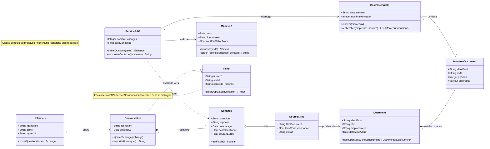

[← Accueil](README.md)

# 10. Diagramme de classes

## Modèle objet de l'assistant PPV

Dix classes, correspondant au périmètre du prototype et à l'escalade prévue vers ServiceNow. Les classes en vert existent dans le code 🟢, celles en rouge restent à construire 🔴.

## Ce que montre le modèle

| Relation | Lecture |
|---|---|
| `Conversation` ◆— `Echange` | Composition : un échange n'existe pas hors de sa conversation. Supprimer la conversation supprime les échanges |
| `Echange` ◇— `SourceCitee` | Agrégation : les sources existent indépendamment, elles sont seulement rattachées à la réponse |
| `Document` ◆— `MorceauDocument` | Composition : les morceaux sont produits par le découpage du document (1 000 caractères, 200 de chevauchement) |
| `BaseVectorielle` ◇— `MorceauDocument` | Agrégation : la base indexe les morceaux sans les posséder — c'est ce qui permet de réindexer sans tout reconstruire |
| `ServiceRAG` → `BaseVectorielle` et `ModeleIA` | Les deux dépendances qui portent la démonstration de faisabilité |

## Correspondance avec le code

| Classe | Fichier du dépôt | Statut |
|---|---|---|
| `ServiceRAG` | `rag-service.js` | 🟢 Vérifié |
| `BaseVectorielle` | Chroma, conteneur Docker | 🟢 Vérifié |
| `Document`, `MorceauDocument` | `vectorize.py` | 🟢 Vérifié |
| `Echange`, `SourceCitee` | `server-fixed.js` | 🟢 Vérifié |
| `ModeleIA` | API OpenAI | 🟢 Vérifié |
| `Utilisateur`, `Conversation` | Pas de persistance dans le prototype | 🔴 À construire |
| `Ticket` | API ServiceNow | 🔴 À construire |

> `scoreConfiance` et `estFiable()` matérialisent le seuil en dessous duquel l'assistant doit refuser de répondre et proposer l'escalade. C'est le point dur identifié en itération 2 : un modèle de langage répond avec assurance même sans information pertinente.
