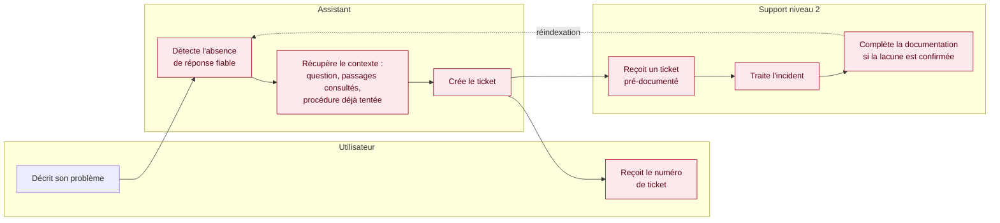

## Parcours 3 — Escalade vers le support de niveau 2

*La boucle de retour — le technicien complète la documentation, qui est réindexée — est ce qui rend l'assistant plus pertinent au fil du temps. Elle est à construire.*
