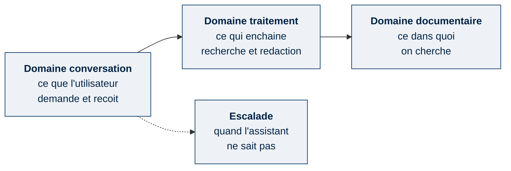
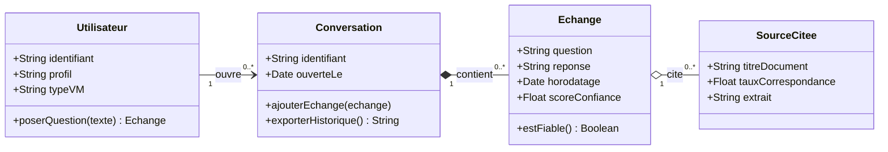
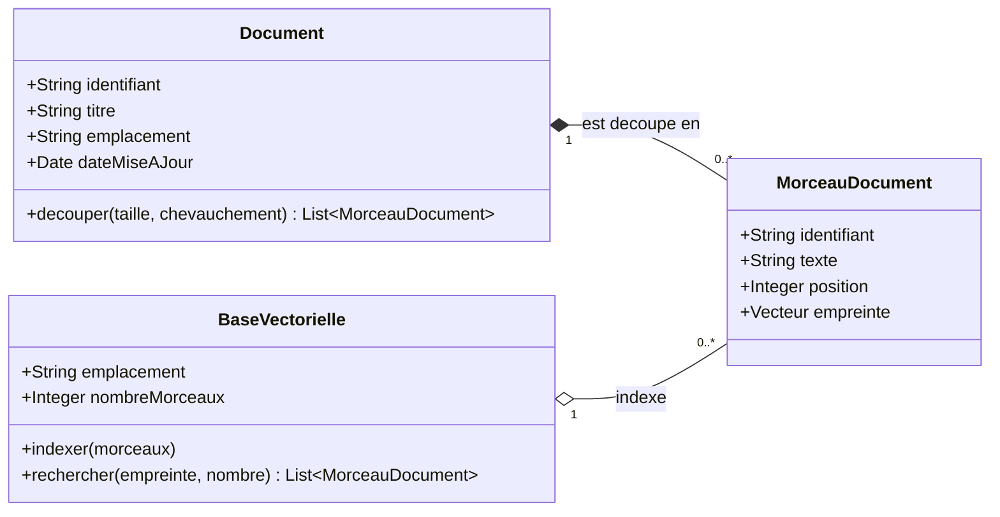
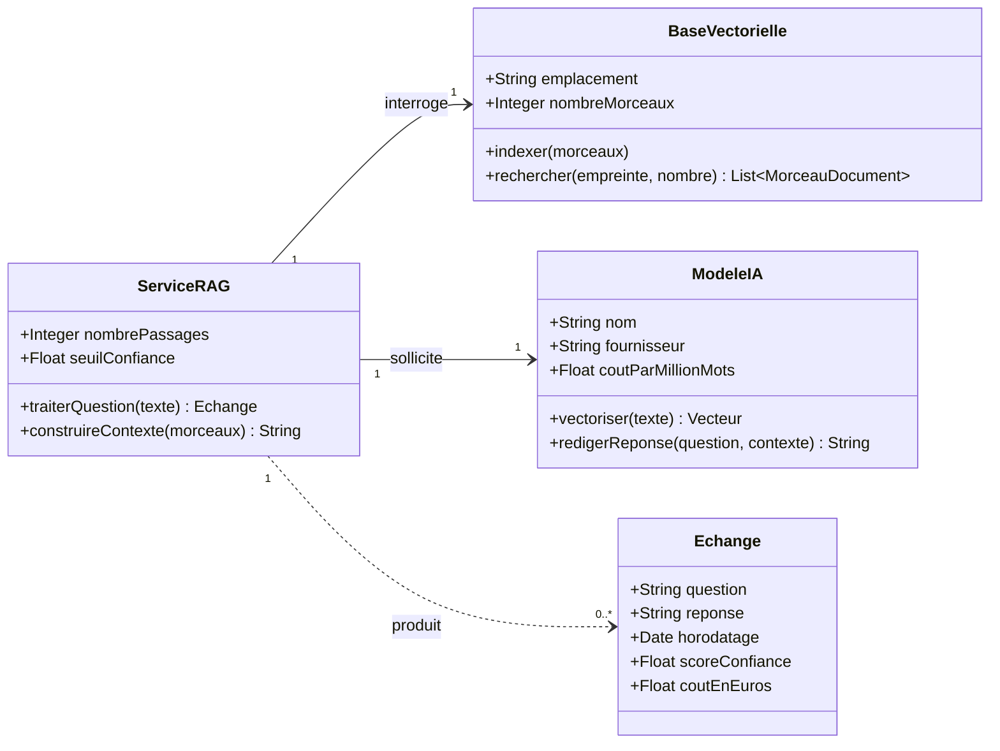
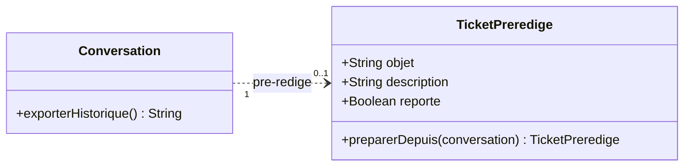

[← Accueil](README.md)

# 10. Diagramme de classes

## 10.1 Le principe

Un diagramme de classes répond à une seule question : **de quoi le système parle-t-il ?**

Chaque boîte est un type d'objet manipulé par l'application. Elle contient ce que l'objet sait (ses données) et ce qu'il sait faire (ses actions). Les traits indiquent comment les objets sont reliés, les chiffres combien.

| Symbole | Lecture |
|---|---|
| `"1" --> "*"` | Un objet est relié à plusieurs autres |
| Losange plein ◆ | L'un ne peut pas exister sans l'autre |
| Losange creux ◇ | Les deux existent séparément, ils sont seulement rattachés |
| Trait pointillé | Dépendance ponctuelle : l'un utilise l'autre sans le contenir |

Le modèle est découpé en trois domaines, présentés séparément ci-dessous.

## 10.2 Vue d'ensemble

## 10.3 Domaine conversation

Ce que l'utilisateur demande, et ce qu'il reçoit en retour.

**Comment le lire.** Un utilisateur ouvre plusieurs conversations. Une conversation contient plusieurs échanges, et ces échanges disparaissent avec elle (losange plein). Chaque échange cite plusieurs sources, qui elles continuent d'exister ailleurs (losange creux).

`scoreConfiance` et `estFiable()` sont le point sensible du projet : c'est le seuil en dessous duquel l'assistant doit refuser de répondre. Sans lui, un modèle de langage invente une procédure plausible quand il ne sait pas.

## 10.4 Domaine documentaire

Ce dans quoi l'assistant cherche.

**Comment le lire.** Un document est découpé en morceaux de 1 000 caractères, se chevauchant sur 200 caractères. Ces morceaux appartiennent au document : s'il disparaît, ils disparaissent (losange plein).

La base de recherche, elle, ne fait que les indexer (losange creux). C'est cette distinction qui permet de réindexer une documentation mise à jour sans tout reconstruire.

`empreinte` est la traduction du texte en nombres représentant son sens. C'est elle qui rend possible la recherche par le sens plutôt que par mots-clés.

## 10.5 Domaine traitement

Ce qui fait le lien entre la question et la documentation.

**Comment le lire.** `ServiceRAG` est la classe centrale du prototype, celle qui porte toute la démonstration de faisabilité. Elle fait trois choses dans l'ordre : interroger la base de recherche, construire le contexte à partir des morceaux obtenus, demander la rédaction au modèle d'IA.

`ModeleIA` regroupe deux usages distincts du même fournisseur : `vectoriser()` traduit un texte en nombres, `redigerReponse()` écrit la réponse. Ce sont deux modèles différents dans le code — l'un pour trouver, l'autre pour rédiger.

## 10.6 Escalade

Ce qui se passe quand l'assistant ne sait pas répondre.

**Comment le lire.** Le trait est pointillé et porte `0..1` : une conversation peut donner lieu à un ticket, ou à aucun. C'est tout l'enjeu du projet — chaque conversation qui se termine sans ticket est un incident résolu sans mobiliser le support.

Le ticket pré-rédigé reprend l'historique de l'échange. L'utilisateur le colle lui-même dans ServiceNow : le technicien de niveau 2 reçoit un dossier déjà documenté plutôt qu'une demande vide, et l'assistant n'a besoin d'aucun droit d'écriture sur l'outil.

## 10.7 Correspondance avec le code

| Classe | Fichier du dépôt | Statut |
|---|---|---|
| `ServiceRAG` | `rag-service.js` | 🟢 Vérifié |
| `BaseVectorielle` | Chroma, conteneur Docker | 🟢 Vérifié |
| `Document`, `MorceauDocument` | `vectorize.py` | 🟢 Vérifié |
| `Echange`, `SourceCitee` | `server-fixed.js` | 🟢 Vérifié |
| `ModeleIA` | API OpenAI | 🟢 Vérifié |
| `Utilisateur`, `Conversation` | Pas de persistance dans le prototype | 🔴 À construire |
| `TicketPreredige` | Pré-rédaction par le serveur, report manuel dans ServiceNow par l'utilisateur | 🔴 À construire |
