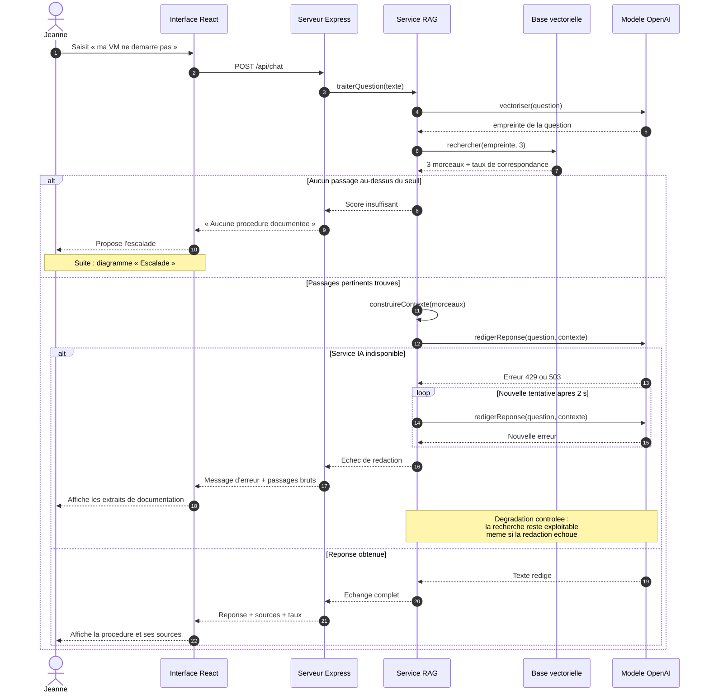
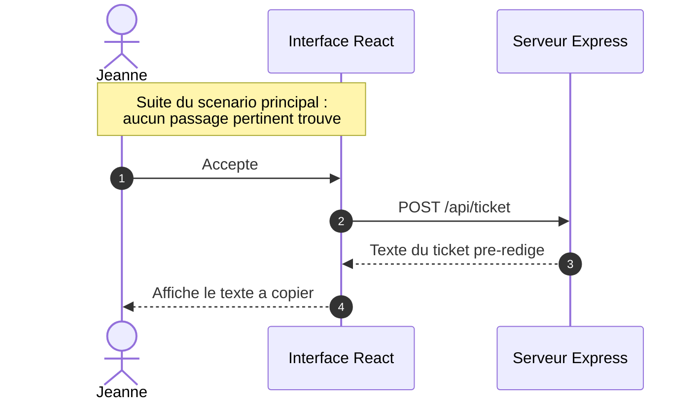

[← Accueil](README.md)

# 11. Diagramme de séquence

## Scénario principal — Résolution d'un incident avec cas d'erreur

Le scénario nominal est celui qui fonctionne aujourd'hui. Deux cas d'erreur y sont intégrés : l'absence de passage pertinent dans la documentation, et l'indisponibilité du service d'IA — panne réellement rencontrée lors du prototypage, à l'épuisement du crédit du fournisseur.

## Escalade

## Les trois chemins

| Chemin | Déclencheur | Comportement attendu | Statut |
|---|---|---|---|
| Nominal | Passages trouvés, service disponible | Réponse rédigée avec ses sources citées | 🟢 Vérifié |
| Erreur documentaire | Aucun morceau au-dessus du seuil de correspondance | Refus de répondre, puis pré-rédaction du ticket, que l'utilisateur colle dans ServiceNow | 🔴 À construire |
| Erreur technique | Le service d'IA renvoie une erreur de quota ou d'indisponibilité | Une nouvelle tentative, puis affichage des extraits bruts | 🔴 À construire |

## Pourquoi ces deux cas d'erreur

**L'erreur documentaire** est le point dur du projet. Un modèle de langage répond avec assurance même lorsque aucun document ne traite la question : sans seuil de correspondance, l'assistant invente une procédure plausible. Dans un contexte de support informatique, c'est le risque le plus grave.

**L'erreur technique** a été rencontrée pendant le prototypage, à l'épuisement du crédit d'essai du fournisseur. Elle a montré que la dépendance à un service externe est un point de rupture, et c'est ce constat qui a motivé l'itération 3 — la tentative d'exécution locale du modèle de vectorisation, restée inaboutie.

La dégradation contrôlée prévue ici est importante : même si la rédaction échoue, la recherche documentaire a déjà produit un résultat exploitable. L'utilisateur reçoit les extraits bruts plutôt qu'un écran vide.
