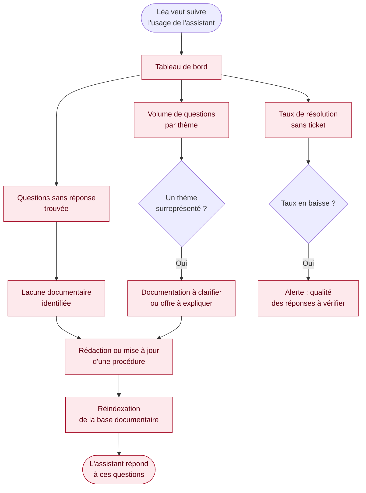

## Parcours 4 — Gestionnaire du parc

Utilisateur type : Léa, gestionnaire du parc de machines virtuelles.

*Ce parcours est entièrement à construire. Il conditionne pourtant la mesure des résultats : sans lui, aucun des critères de passage de version du plan de release n'est observable.*
