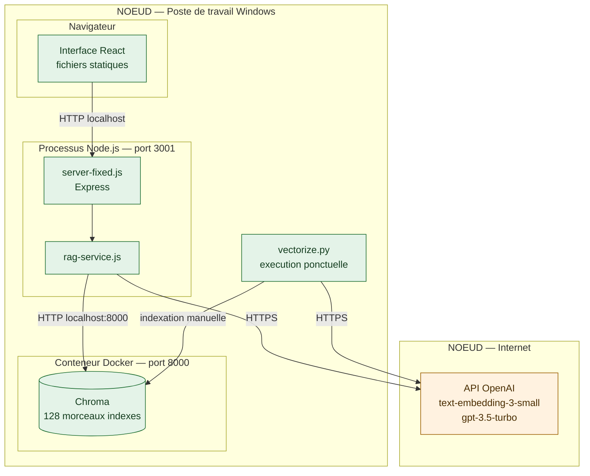
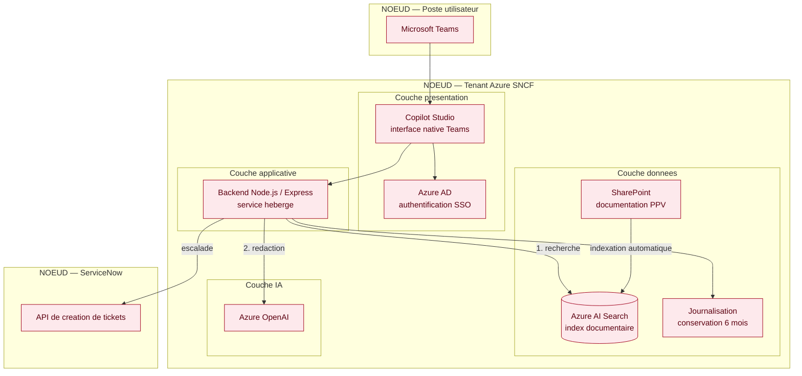

[← Accueil](README.md)

> ⚠️ Version obsolète, conservée pour l'historique : voir la version à jour, [12bis — Diagramme de déploiement](12bis-diagramme-deploiement.md).

# 12. Diagramme de déploiement

## Environnement de prototypage — ce qui tourne aujourd'hui

Tout s'exécute sur un seul poste de travail, à l'exception des appels au fournisseur d'IA.

| Caractéristique | Valeur |
|---|---|
| Nombre de machines | 1 (poste de travail) |
| Démarrage | Manuel, deux fenêtres de commande |
| Exposition réseau | Aucune — accès local uniquement |
| Secrets | Fichier de configuration local, exclu du dépôt |
| Utilisateurs simultanés | 1 |

## Architecture de déploiement cible

L'environnement cible repose sur l'écosystème Azure de la SNCF. La base vectorielle locale disparaît au profit d'Azure AI Search, et l'interface passe par Copilot Studio plutôt que par une application à maintenir.

| Caractéristique | Valeur |
|---|---|
| Hébergement | Azure, écosystème SNCF |
| Authentification | Azure AD, authentification unique |
| Point d'entrée | Microsoft Teams via Copilot Studio |
| Données de journalisation | Conservation 6 mois, conformité RGPD |
| Utilisateurs cibles | Environ 1 500 |

## Ce qui change entre les deux

| Élément | Prototype | Cible |
|---|---|---|
| Base de recherche | Chroma, conteneur Docker local | Azure AI Search |
| Modèle d'IA | OpenAI en accès direct | Azure OpenAI |
| Interface | Application React autonome | Copilot Studio dans Teams |
| Indexation | Script Python lancé à la main | Automatique depuis SharePoint |
| Authentification | Aucune | Azure AD, authentification unique |
| Escalade | Aucune | API ServiceNow |

> Le conteneur Docker et la base Chroma sont un choix de prototypage, pas une préconisation. L'option d'une base vectorielle auto-hébergée a été écartée pour la cible : elle imposerait au service PPV d'exploiter une brique supplémentaire, là où Azure AI Search est déjà disponible dans l'environnement SNCF.
