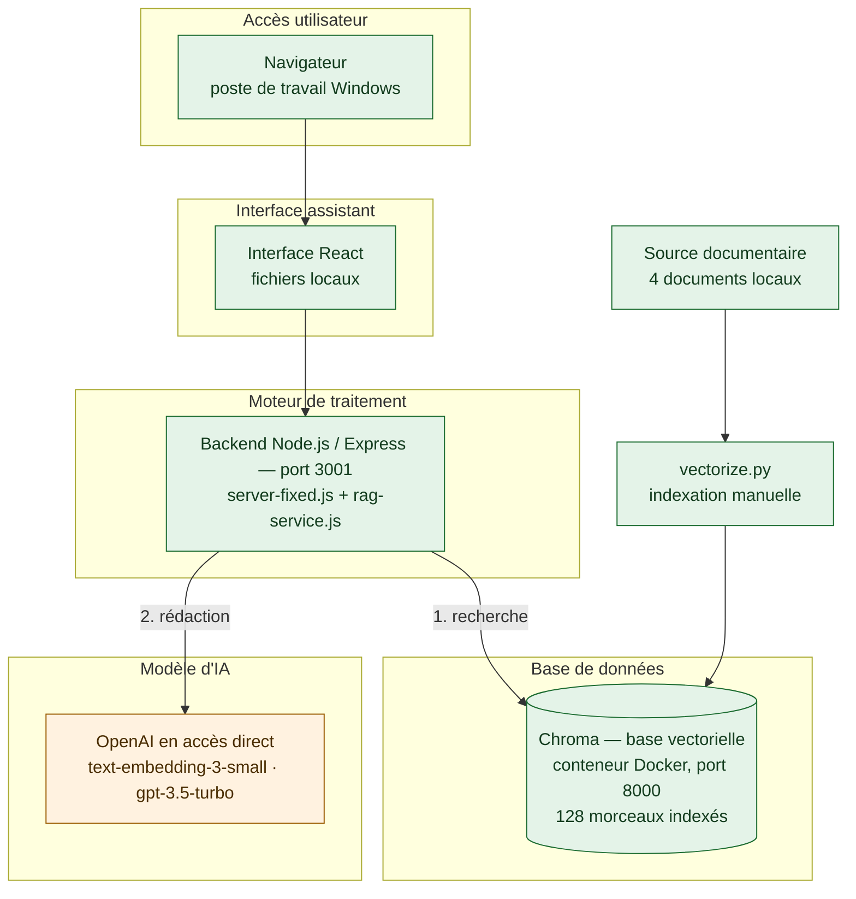
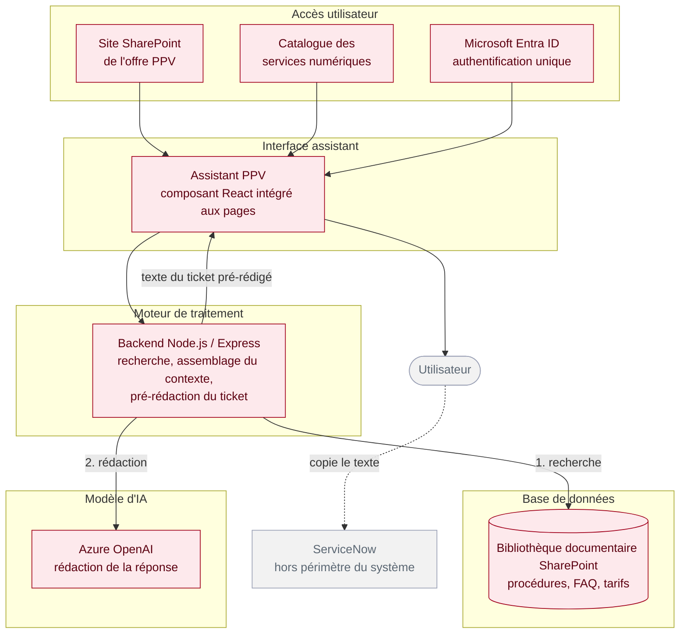
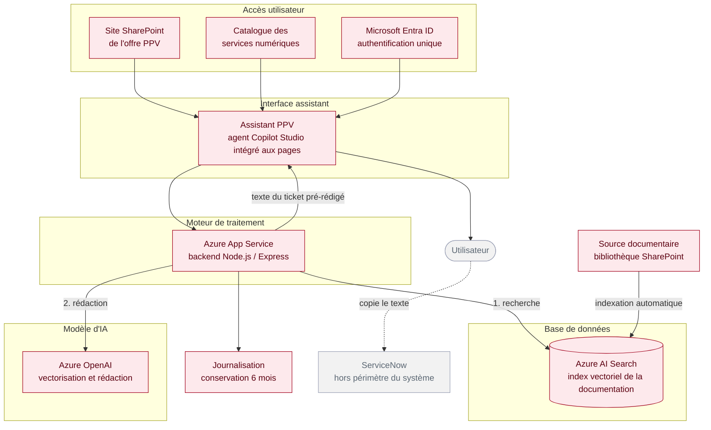

[← Accueil](README.md)

# 12. Diagramme de déploiement

Trois états sont présentés : le prototype tel qu'il s'exécute aujourd'hui, puis les deux phases de l'architecture cible.

Les couches portent **les mêmes noms d'un schéma à l'autre** et apparaissent dans le même ordre. Celles qui n'existent pas à un stade ne sont pas représentées. Chaque stade comporte **une seule base de données**.

| Couche | Rôle |
|---|---|
| Accès utilisateur | Par où l'utilisateur entre |
| Interface assistant | Ce qu'il voit et manipule |
| Moteur de traitement | Ce qui cherche, assemble et sollicite le modèle |
| Base de données | Ce qui est interrogé |
| Modèle d'IA | Ce qui vectorise et rédige |

**Un point commun aux deux cibles : l'assistant n'écrit jamais dans ServiceNow.** Lorsqu'il ne sait pas répondre, il pré-rédige le texte du ticket ; c'est l'utilisateur qui le reporte lui-même dans l'outil. ServiceNow figure donc hors du périmètre du système, atteint par l'utilisateur et non par l'application.

## 12.1 Prototype — ce qui s'exécute aujourd'hui

🟢 Opérationnel. Une seule machine, démarrage manuel, un utilisateur, aucune exposition réseau. Pas de pré-rédaction de ticket à ce stade.

## 12.2 Cible — phase 1 (MVP)

Le MVP reprend le principe démontré par le prototype : chercher dans la documentation, puis faire rédiger la réponse. Les réponses ne sont donc pas écrites à l'avance. Ce qui change par rapport au prototype, c'est l'emplacement de chaque brique — l'assistant vit dans SharePoint, et la documentation interrogée est celle du service, pas quatre fichiers d'exemple.

🔴 À construire.

## 12.3 Cible — phase 2 (assistant augmenté)

La phase 2 ne change ni les points d'entrée, ni le principe de fonctionnement. Elle industrialise : l'interface devient un agent Copilot Studio au lieu d'un composant à maintenir, la documentation est indexée automatiquement dans un index vectoriel au lieu d'être interrogée telle quelle, et le backend est hébergé.

🔴 À construire.

## 12.4 Comparaison des trois états

| Couche | Prototype 🟢 | Phase 1 — MVP 🔴 | Phase 2 🔴 |
|---|---|---|---|
| **Accès utilisateur** | Navigateur, poste local | SharePoint de l'offre PPV et catalogue des services numériques | Identique à la phase 1 |
| **Interface assistant** | Interface React autonome | Composant React intégré aux pages | Agent Copilot Studio intégré aux pages |
| **Moteur de traitement** | Backend Node.js / Express sur le poste | Backend Node.js / Express | Backend Node.js / Express hébergé sur Azure App Service |
| **Base de données** | Chroma, index vectoriel en conteneur | Bibliothèque documentaire SharePoint, interrogée directement | Azure AI Search, index vectoriel |
| **Modèle d'IA** | OpenAI en accès direct | Azure OpenAI | Azure OpenAI |
| Source documentaire | 4 documents locaux | Bibliothèque SharePoint | Bibliothèque SharePoint, indexée automatiquement |
| Indexation | Script Python lancé à la main | Aucune, la documentation est interrogée telle quelle | Automatique à chaque mise à jour |
| Escalade | Aucune | Ticket pré-rédigé, reporté par l'utilisateur | Ticket pré-rédigé, reporté par l'utilisateur |
| Authentification | Aucune | Microsoft Entra ID | Microsoft Entra ID |
| Journalisation | Aucune | Héritée de SharePoint | Interne SNCF, 6 mois, conformité RGPD |
| Utilisateurs | 1 | Environ 1 500 | Environ 1 500 |

## 12.5 Trois lectures du tableau

**Le principe ne change jamais.** Les trois états cherchent d'abord dans la documentation, puis font rédiger la réponse à partir des seuls passages trouvés. C'est exactement ce que le prototype a démontré, et c'est pour cela qu'il constitue une preuve de faisabilité et non une maquette jetable.

**Ce qui change d'un stade à l'autre, c'est la provenance des briques.** Chroma devient Azure AI Search, OpenAI en direct devient Azure OpenAI, le poste de travail devient un service hébergé. Aucune de ces substitutions ne remet en cause le principe : elles répondent à des contraintes de conformité et d'exploitation, pas de conception.

**L'assistant n'écrit jamais dans ServiceNow.** Il pré-rédige le texte du ticket, l'utilisateur le reporte. Ce choix évite d'avoir à gérer des droits d'écriture sur un outil tiers, et laisse à l'utilisateur la décision d'escalader — y compris celle de ne pas le faire si la réponse l'a finalement dépanné.

## 12.6 Points à confirmer

| Point | État |
|---|---|
| Hébergement du backend en phase 1 — Azure App Service dès le MVP, ou autre | À trancher |
| Mécanisme d'interrogation de la bibliothèque SharePoint en phase 1, sans index vectoriel | À préciser |
| Service exact de journalisation côté SNCF | À préciser |
