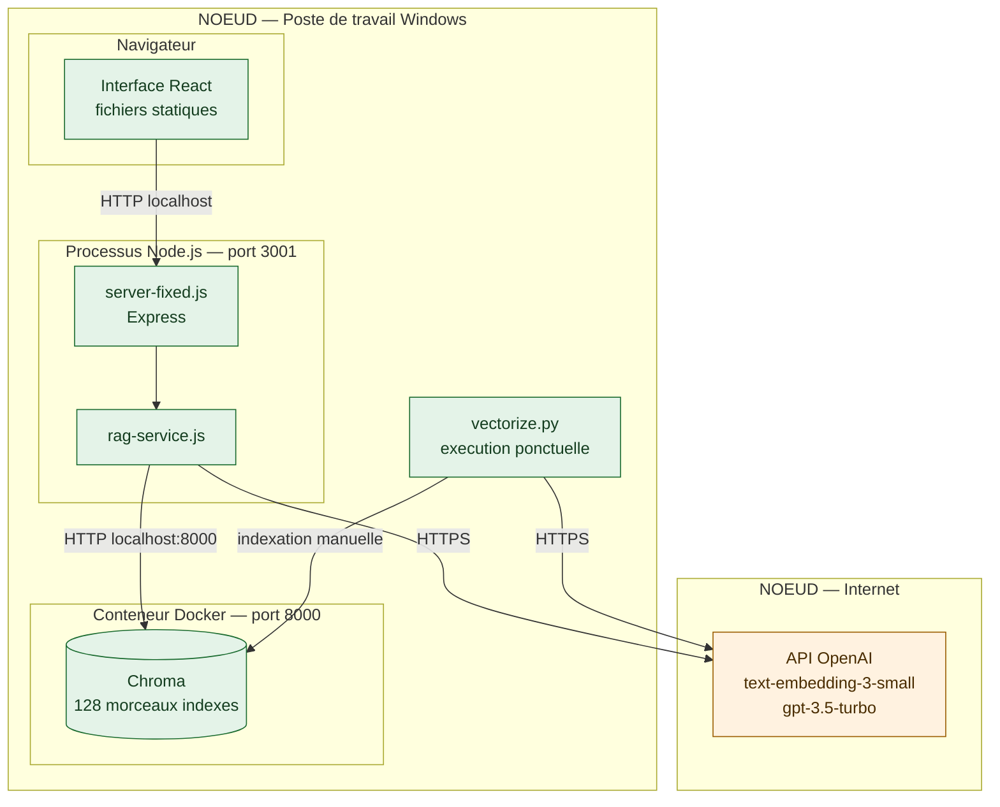
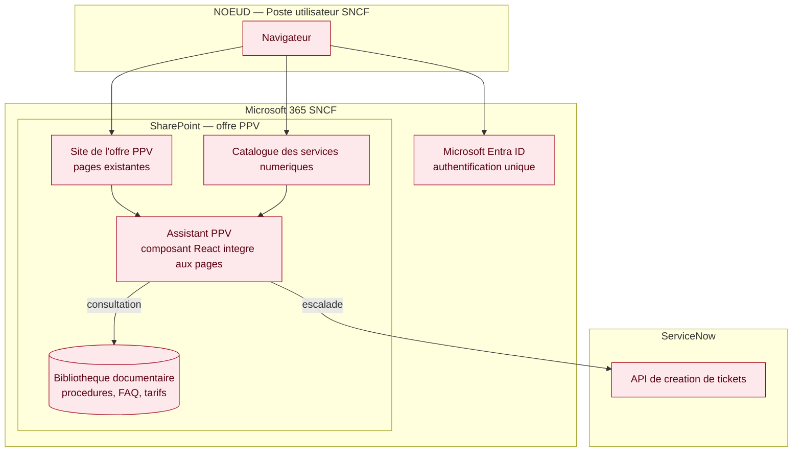
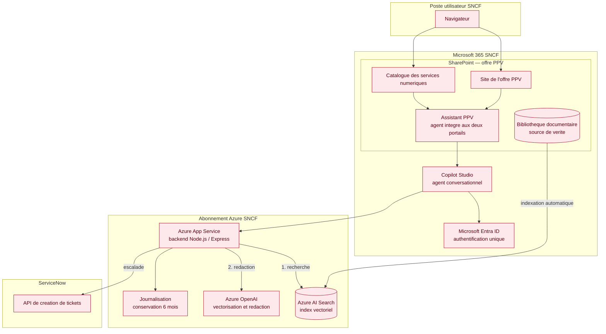

[← Accueil](README.md)

# 12. Diagramme de déploiement

Trois états sont présentés : le prototype tel qu'il s'exécute aujourd'hui, puis les deux phases de l'architecture cible. Le prototype n'est pas une version réduite de la cible : il sert à lever un risque technique, avec des briques choisies pour leur facilité d'installation.

## 12.1 Prototype — ce qui s'exécute aujourd'hui

Tout tient sur un poste de travail, à l'exception des appels au fournisseur d'IA.

| Caractéristique | Valeur |
|---|---|
| Machines | 1 poste de travail |
| Démarrage | Manuel, deux fenêtres de commande |
| Exposition réseau | Aucune, accès local |
| Utilisateurs simultanés | 1 |

🟢 Opérationnel. Les briques Docker et Chroma relèvent du prototypage et ne sont pas reconduites en cible.

## 12.2 Cible — phase 1 (MVP)

Le MVP ne génère pas de texte : il guide l'utilisateur dans des parcours prédéfinis et escalade vers ServiceNow quand le parcours n'aboutit pas. Il ne mobilise donc aucune brique d'intelligence artificielle, et reste entièrement dans l'environnement Microsoft 365 déjà en place.

| Caractéristique | Valeur |
|---|---|
| Points d'entrée | Site SharePoint de l'offre PPV et catalogue des services numériques, là où les utilisateurs consultent déjà l'offre |
| Traitement | Parcours de diagnostic prédéfinis, aucune génération de texte |
| Authentification | Héritée de SharePoint, authentification unique |
| Escalade | API ServiceNow |
| Briques nouvelles à déployer | Aucune hors du périmètre Microsoft 365 existant |

🔴 À construire. L'intérêt de cette phase est sa sobriété : aucun service supplémentaire à faire valider par la sécurité, aucun coût à l'usage, une mise en service rapide.

## 12.3 Cible — phase 2 (assistant augmenté)

La phase 2 ajoute la recherche documentaire et la génération de réponses. Les points d'entrée restent les mêmes qu'en phase 1 : le site SharePoint de l'offre PPV et le catalogue des services numériques. Ce qui change est derrière : Azure AI Search remplace Chroma, Azure OpenAI remplace l'accès direct au fournisseur, et Copilot Studio fournit le moteur conversationnel sans application à maintenir.

| Caractéristique | Valeur |
|---|---|
| Points d'entrée | Site SharePoint de l'offre PPV et catalogue des services numériques, via le même agent |
| Recherche documentaire | Azure AI Search, indexation automatique depuis SharePoint |
| Génération des réponses | Azure OpenAI, dans le périmètre du tenant SNCF |
| Authentification | Microsoft Entra ID, authentification unique |
| Journalisation | Interne SNCF, conservation 6 mois, conformité RGPD |
| Escalade | API ServiceNow, avec transmission de l'historique de l'échange |
| Utilisateurs cibles | Environ 1 500 |

🔴 À construire.

## 12.4 Ce qui change d'un état à l'autre

| Élément | Prototype | Phase 1 | Phase 2 |
|---|---|---|---|
| Point d'entrée | Navigateur, poste local | SharePoint de l'offre | SharePoint de l'offre et catalogue des services numériques |
| Interface | Application React autonome | Composant intégré à la page | Agent Copilot Studio |
| Traitement | Recherche documentaire et génération | Parcours prédéfinis, sans IA | Recherche documentaire et génération |
| Base de recherche | Chroma, conteneur Docker | Aucune | Azure AI Search |
| Modèle d'IA | OpenAI en accès direct | Aucun | Azure OpenAI |
| Indexation | Script Python lancé à la main | Sans objet | Automatique depuis SharePoint |
| Authentification | Aucune | Héritée de SharePoint | Microsoft Entra ID |
| Escalade | Aucune | API ServiceNow | API ServiceNow |

> **Pourquoi la cible n'est pas le prototype mis en ligne.** Chroma et Docker ont été retenus pour prototyper vite, sur un poste de travail. Les conserver en production imposerait au service PPV d'exploiter une brique supplémentaire, à faire valider par la sécurité, alors qu'Azure AI Search rend le même service et figure déjà au catalogue SNCF. Ce que le prototype démontre, c'est le principe — la recherche documentaire précède la génération — et non le choix des outils.
