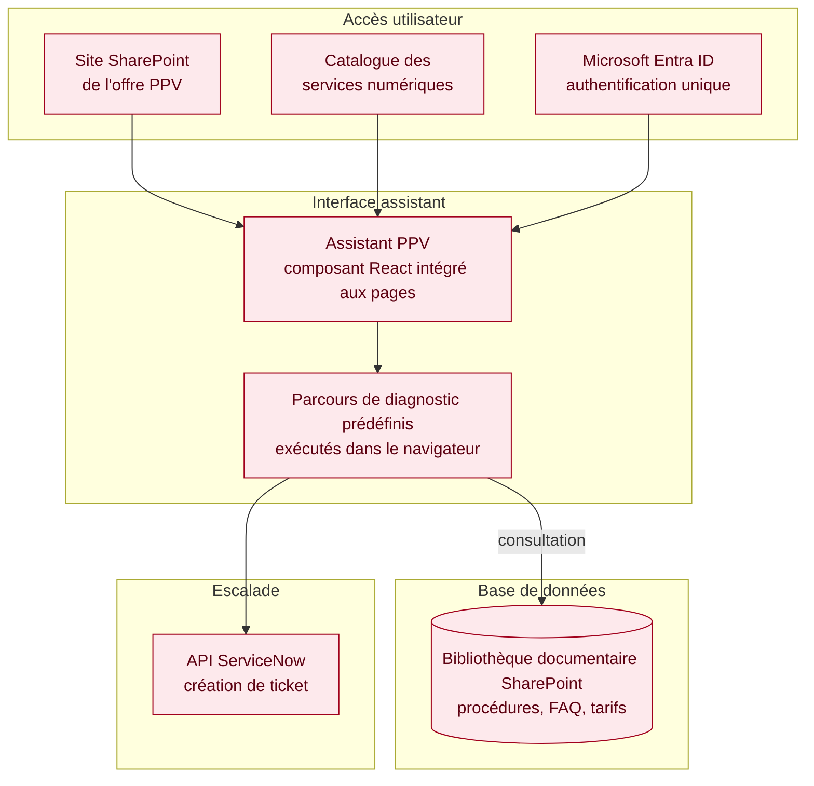
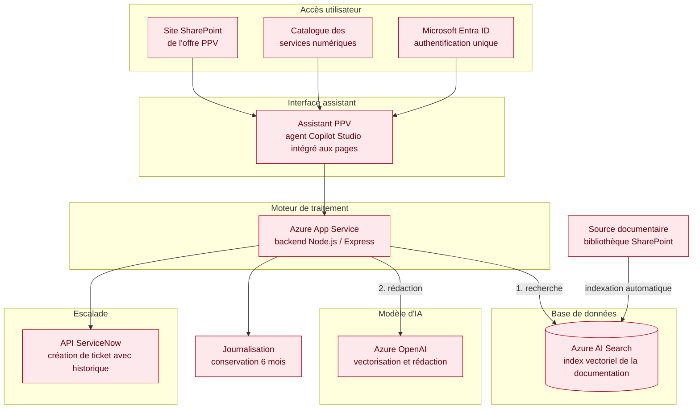

[← Accueil](README.md)

# 12. Diagramme de déploiement

Trois états sont présentés : le prototype tel qu'il s'exécute aujourd'hui, puis les deux phases de l'architecture cible.

Les couches portent **les mêmes noms d'un schéma à l'autre**, et apparaissent dans le même ordre. Celles qui n'existent pas à un stade donné ne sont pas représentées : un diagramme de déploiement ne montre que ce qui s'exécute réellement. Les absences sont signalées dans le tableau comparatif en 12.4.

Chaque stade comporte **une seule base de données**.

## 12.1 Prototype — ce qui s'exécute aujourd'hui

Cinq couches. Aucune escalade : le prototype ne crée pas de ticket.

🟢 Opérationnel. Une seule machine, démarrage manuel, un utilisateur, aucune exposition réseau.

## 12.2 Cible — phase 1 (MVP)

Quatre couches. Le MVP ne génère pas de texte : il déroule des parcours de diagnostic écrits à l'avance, que le navigateur exécute seul. Il n'y a donc ni serveur de traitement, ni modèle d'IA.

🔴 À construire. Aucune brique nouvelle hors du périmètre Microsoft 365 déjà en place : pas de service à faire valider par la sécurité, pas de coût à l'usage.

## 12.3 Cible — phase 2 (assistant augmenté)

Six couches. Les points d'entrée et l'interface ne changent pas. Ce qui s'ajoute est derrière : un moteur de traitement hébergé, un index vectoriel à la place de la consultation directe, et un modèle d'IA.

🔴 À construire.

## 12.4 Comparaison des trois états

| Couche | Prototype 🟢 | Phase 1 — MVP 🔴 | Phase 2 🔴 |
|---|---|---|---|
| **Accès utilisateur** | Navigateur, poste local | SharePoint de l'offre PPV et catalogue des services numériques | Identique à la phase 1 |
| **Interface assistant** | Interface React autonome | Composant React intégré aux pages, parcours exécutés dans le navigateur | Agent Copilot Studio intégré aux pages |
| **Moteur de traitement** | Node.js / Express sur le poste | *Absent* | Node.js / Express hébergé sur Azure App Service |
| **Base de données** | Chroma, index vectoriel en conteneur | Bibliothèque documentaire SharePoint | Azure AI Search, index vectoriel |
| **Modèle d'IA** | OpenAI en accès direct | *Absent* | Azure OpenAI |
| **Escalade** | *Absente* | API ServiceNow | API ServiceNow, avec transmission de l'historique |
| Source documentaire | 4 documents locaux | Bibliothèque SharePoint, consultée directement | Bibliothèque SharePoint, indexée automatiquement |
| Indexation | Script Python lancé à la main | Sans objet | Automatique à chaque mise à jour |
| Authentification | Aucune | Microsoft Entra ID | Microsoft Entra ID |
| Journalisation | Aucune | Héritée de SharePoint | Interne SNCF, 6 mois, conformité RGPD |
| Utilisateurs | 1 | Environ 1 500 | Environ 1 500 |

## 12.5 Trois lectures du tableau

**Le MVP n'a pas de moteur de traitement, et c'est voulu.** Dérouler des parcours écrits à l'avance est quelque chose qu'un navigateur sait faire seul. Un serveur ne redevient nécessaire qu'à partir du moment où il faut chercher dans la documentation et rédiger une réponse — donc en phase 2.

**La base de données change de nature à chaque étape, mais il n'y en a jamais qu'une.** Le prototype interroge un index vectoriel local, le MVP consulte directement la documentation SharePoint, la phase 2 interroge un index vectoriel hébergé. La bibliothèque SharePoint n'est une base interrogée qu'en phase 1 ; en phase 2, elle devient une source qui alimente l'index.

**Le prototype n'est pas la cible en réduction.** Chroma et Docker ont été retenus pour prototyper vite sur un poste de travail. Les conserver imposerait au service PPV d'exploiter une brique supplémentaire, à faire valider par la sécurité, là où Azure AI Search rend le même service et figure déjà au catalogue SNCF. Ce que le prototype démontre, c'est le principe — la recherche documentaire précède la génération — et non le choix des outils.
