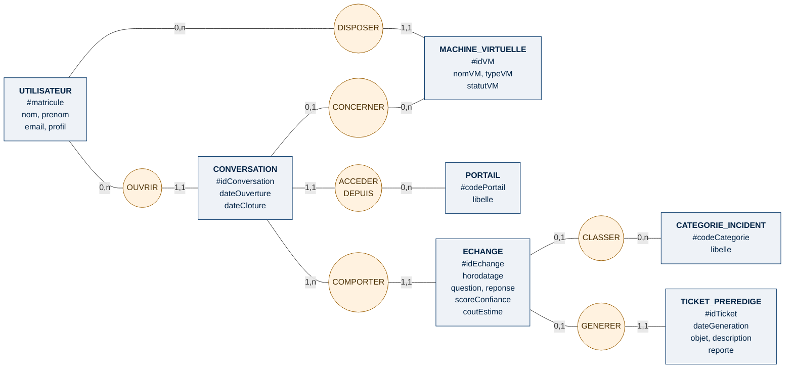
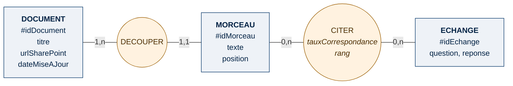
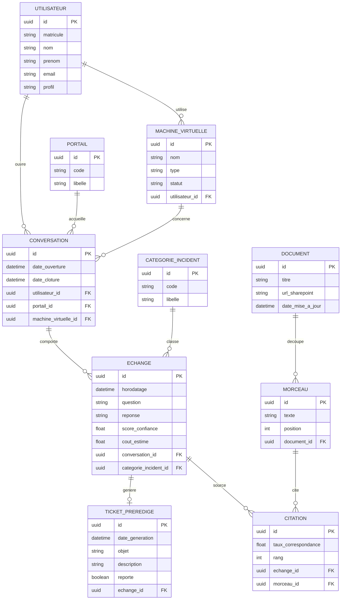

[← Accueil](README.md)

# 13. Modèle de données — MCD et modèle logique

## 13.1 Le principe

Deux étapes, et la seconde se déduit de la première.

Le **modèle conceptuel** (MCD) décrit ce dont le système parle, sans se préoccuper de la technique : des entités, les liens entre elles, et le nombre d'occurrences de chaque côté — les cardinalités. Il se lit comme des phrases : « un utilisateur ouvre de zéro à plusieurs conversations ; une conversation est ouverte par un et un seul utilisateur ».

Le **modèle logique** (MLD) traduit ce modèle en tables, en appliquant des règles mécaniques. C'est l'étape qui précède la création réelle de la base.

| Notation | Lecture |
|---|---|
| `0,n` | De zéro à plusieurs |
| `1,1` | Un et un seul |
| `1,n` | Au moins un, et jusqu'à plusieurs |
| `0,1` | Zéro ou un |

## 13.2 Dictionnaire des données

| Donnée | Type | Description |
|---|---|---|
| matricule | Texte | Identifiant de l'agent, issu de l'annuaire d'entreprise |
| profil | Texte | Usage quotidien, occasionnel, ou gestionnaire du parc |
| nomVM | Texte | Nom de la machine virtuelle |
| typeVM | Texte | Standard ou clone |
| statutVM | Texte | Opérationnelle, dégradée, hors service |
| codePortail | Texte | Point d'entrée : offre PPV ou catalogue des services numériques |
| dateOuverture | Horodatage | Début de la conversation |
| question | Texte long | Question posée en langage naturel |
| reponse | Texte long | Réponse rédigée par le modèle |
| scoreConfiance | Décimal | Correspondance du meilleur passage trouvé, de 0 à 1 |
| coutEstime | Décimal | Coût de l'échange, en euros |
| codeCategorie | Texte | Famille d'incident : démarrage, performance, accès, tarification |
| titre | Texte | Titre du document source |
| urlSharePoint | Texte | Emplacement du document dans la bibliothèque |
| dateMiseAJour | Date | Dernière modification du document |
| texte | Texte long | Contenu d'un morceau de document |
| position | Entier | Rang du morceau dans son document |
| tauxCorrespondance | Décimal | Proximité entre le morceau et la question |
| objet | Texte | Objet du ticket pré-rédigé |
| reporte | Booléen | L'utilisateur a-t-il indiqué avoir reporté le ticket |

## 13.3 MCD — domaine assistance



## 13.4 MCD — domaine documentaire



`CITER` est une **association porteuse de données** : le taux de correspondance et le rang d'affichage n'appartiennent ni au morceau ni à l'échange, mais à leur rencontre. C'est ce qui permet d'afficher « documentation Diagnostic, 95 % ».

## 13.5 Lecture des cardinalités

| Association | Lecture dans un sens | Lecture dans l'autre |
|---|---|---|
| DISPOSER | Un utilisateur dispose de 0 à n machines virtuelles | Une machine virtuelle est affectée à un et un seul utilisateur |
| OUVRIR | Un utilisateur ouvre de 0 à n conversations | Une conversation est ouverte par un et un seul utilisateur |
| ACCEDER DEPUIS | Une conversation est ouverte depuis un et un seul portail | Un portail donne lieu à 0 à n conversations |
| CONCERNER | Une conversation concerne 0 ou 1 machine virtuelle | Une machine virtuelle est concernée par 0 à n conversations |
| COMPORTER | Une conversation comporte au moins un échange | Un échange appartient à une et une seule conversation |
| CLASSER | Un échange relève de 0 ou 1 catégorie d'incident | Une catégorie regroupe 0 à n échanges |
| GENERER | Un échange génère 0 ou 1 ticket pré-rédigé | Un ticket pré-rédigé provient d'un et un seul échange |
| DECOUPER | Un document est découpé en au moins un morceau | Un morceau appartient à un et un seul document |
| CITER | Un échange cite 0 à n morceaux | Un morceau est cité dans 0 à n échanges |

Trois cardinalités méritent d'être justifiées :

- **CONCERNER est à 0,1** parce qu'une question sur la tarification ne porte sur aucune machine en particulier.
- **CLASSER est à 0,1** parce que la catégorie est déduite après coup : un échange peut rester non classé.
- **GENERER est à 0,1** parce que l'immense majorité des échanges n'aboutit à aucun ticket. C'est précisément l'objectif du projet.

## 13.6 Règles de passage vers le modèle logique

| Règle | Application dans ce modèle |
|---|---|
| Chaque entité devient une table, son identifiant devient la clé primaire | 9 tables issues des 9 entités |
| Une association de type `1,1` d'un côté se traduit par une clé étrangère dans la table du côté `1,1` | OUVRIR, COMPORTER, DECOUPER, GENERER, ACCEDER DEPUIS, DISPOSER |
| Une association `0,n` des deux côtés devient une table à part entière | CITER devient la table CITATION |
| Les données portées par une association rejoignent la table issue de cette association | tauxCorrespondance et rang entrent dans CITATION |

## 13.7 Modèle logique

Convention : clé primaire en tête, clé étrangère précédée de `#`. Chaque entité reçoit un identifiant `id` ; chaque clé étrangère porte le nom de la table d'origine suivi de `_id`.

```
UTILISATEUR (id, matricule, nom, prenom, email, profil)

MACHINE_VIRTUELLE (id, nom, type, statut, #utilisateur_id)

PORTAIL (id, code, libelle)

CONVERSATION (id, date_ouverture, date_cloture,
              #utilisateur_id, #portail_id, #machine_virtuelle_id)

ECHANGE (id, horodatage, question, reponse,
         score_confiance, cout_estime,
         #conversation_id, #categorie_incident_id)

CATEGORIE_INCIDENT (id, code, libelle)

TICKET_PREREDIGE (id, date_generation, objet, description,
                  reporte, #echange_id)

DOCUMENT (id, titre, url_sharepoint, date_mise_a_jour)

MORCEAU (id, texte, position, #document_id)

CITATION (id, taux_correspondance, rang, #echange_id, #morceau_id)
```

## 13.8 Le modèle logique dessiné avec Mermaid



`CITATION` suit exactement le schéma d'une table issue d'une association : son propre identifiant, ses données propres — le taux de correspondance et le rang d'affichage — et les deux clés étrangères qui la relient à l'échange et au morceau cité.

## 13.9 Ce que le modèle ne stocke pas

| Donnée | Raison |
|---|---|
| Le contenu des tickets déposés dans ServiceNow | L'assistant pré-rédige le texte, il n'écrit jamais dans l'outil. Seul le brouillon est conservé |
| Les vecteurs des morceaux | Ils résident dans l'index de recherche, pas dans la base relationnelle |
| Les mots de passe et jetons | L'authentification est déléguée à Microsoft Entra ID |
| Les échanges au-delà de 6 mois | Durée de conservation retenue pour la journalisation, conformité RGPD |

> **Portée de ce modèle.** Le prototype ne persiste rien : il traite une question, renvoie une réponse, et oublie. Ce modèle décrit la base nécessaire au MVP, où la mesure des résultats — taux de résolution sans ticket, catégories d'incidents les plus fréquentes — suppose de conserver l'historique. 🔴 À construire.
