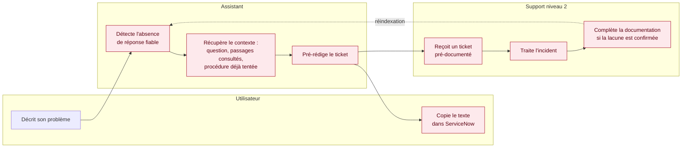

[← Accueil](README.md)

# 16. Pré-rédaction des tickets

Cette page regroupe tout ce qui concerne l'escalade vers le support de niveau 2 : le principe retenu, son déclenchement, le contenu du ticket et l'état d'avancement.

## 16.1 Le principe

**L'assistant n'écrit jamais dans ServiceNow.** Lorsqu'il ne peut pas résoudre l'incident, il **pré-rédige** le texte du ticket ; c'est l'utilisateur qui le copie lui-même dans ServiceNow.

| Raison | Explication |
|---|---|
| Aucun droit d'écriture sur un outil tiers | Pas d'accès en écriture à gérer, à sécuriser et à auditer sur ServiceNow |
| La décision reste à l'utilisateur | Il peut choisir de ne pas escalader si la réponse l'a finalement dépanné |
| Un ticket mieux documenté | Le technicien reçoit d'emblée le contexte : l'utilisateur n'a pas à répéter son problème |

## 16.2 Quand la pré-rédaction se déclenche

| Situation | Déclencheur |
|---|---|
| Aucune procédure documentée | Aucun passage de la documentation au-dessus du seuil de correspondance : l'assistant refuse de répondre plutôt que d'inventer |
| Incident non résolu | L'utilisateur a appliqué la procédure proposée, mais le problème persiste |

Dans les deux cas, l'assistant **propose** l'escalade : l'utilisateur accepte ou non.

## 16.3 Contenu du ticket pré-rédigé

| Élément | Origine |
|---|---|
| Description du problème | Question de l'utilisateur, en langage courant |
| Type de VM (standard ou clone) | Réponse au début du diagnostic |
| Vérifications et procédures déjà tentées | Historique de l'échange |
| Passages de documentation consultés | Résultat de la recherche documentaire |
| Niveau de priorité (P1 à P4) | Calculé selon le caractère bloquant de l'incident |
| Copie d'écran du message d'erreur | Facultative, ajoutée par l'utilisateur |

## 16.4 Le parcours d'escalade

*La boucle de retour — le technicien complète la documentation, qui est réindexée — rend l'assistant plus pertinent au fil du temps.*

## 16.5 Où la retrouver dans la documentation

| Page | Ce qu'elle montre |
|---|---|
| [2. Description fonctionnelle](02-description-fonctionnelle.md) | Place de l'escalade dans le parcours de résolution |
| [5. Planification](05-planification.md) | Priorité « doit avoir » dans le backlog |
| [8. Plan de release](08-plan-de-release.md) | Livrée dans la bêta |
| [Cas d'utilisation](diagramme-cas-utilisation.md) | « Préparer un ticket SNOW », extension du diagnostic |
| [Diagramme d'activité — résolution d'incident](8-userflow-resolution-incident.md) | Étapes de Jeanne jusqu'au ticket |
| [Diagramme de séquence](11-diagramme-sequence.md) | Échanges techniques : `POST /api/ticket`, texte affiché puis collé dans ServiceNow |
| [Diagramme de déploiement](12bis-diagramme-deploiement.md) | ServiceNow hors du périmètre du système |

## 16.6 État d'avancement

| Élément | Statut |
|---|---|
| Écran de préparation du ticket dans la maquette (itération 0) | 🟢 Vérifié |
| Détection de l'absence de réponse fiable (seuil de correspondance) | 🔴 À construire |
| Génération du texte du ticket par le serveur | 🔴 À construire |
| Boucle de retour vers la documentation | 🔴 À construire |
