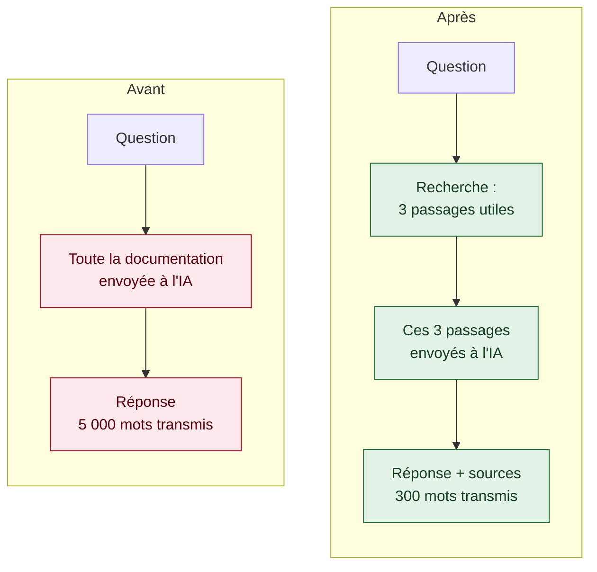

Le principe du RAG en 3 temps

```mermaid
flowchart LR
    subgraph AV["Avant"]
        direction TB
        A1["Question"] --> A2["Toute la documentation<br/>envoyée à l'IA"] --> A3["Réponse<br/>5 000 mots transmis"]
    end
    subgraph AP["Après"]
        direction TB
        B1["Question"] --> B2["Recherche :<br/>3 passages utiles"] --> B3["Ces 3 passages<br/>envoyés à l'IA"] --> B4["Réponse + sources<br/>300 mots transmis"]
    end

    AV ~~~ AP

    classDef ko fill:#fde9ec,stroke:#a1001c,color:#5c0010;
    classDef ok fill:#e4f3e8,stroke:#1a6b2f,color:#143d1f;
    class A2,A3 ko
    class B2,B3,B4 ok
```
