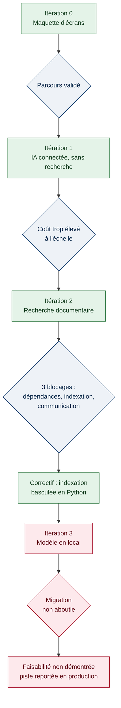

## Les itérations du prototype

```mermaid
flowchart TD
    I0["Itération 0<br/>Maquette d'écrans"] --> R0{Parcours validé}
    R0 --> I1["Itération 1<br/>IA connectée, sans recherche"]
    I1 --> R1{"Coût trop élevé<br/>à l'échelle"}
    R1 --> I2["Itération 2<br/>Recherche documentaire"]
    I2 --> R2{"3 blocages :<br/>dépendances, indexation,<br/>communication"}
    R2 --> F2["Correctif : indexation<br/>basculée en Python"]
    F2 --> I3["Itération 3<br/>Modèle en local"]
    I3 --> R3{"Migration<br/>non aboutie"}
    R3 --> OUT["Faisabilité non démontrée<br/>piste reportée en production"]

    classDef ok fill:#e4f3e8,stroke:#1a6b2f,color:#143d1f;
    classDef ko fill:#fde9ec,stroke:#a1001c,color:#5c0010;
    classDef neutre fill:#eef2f7,stroke:#003366,color:#002244;
    class I0,I1,I2,F2 ok
    class I3,R3,OUT ko
    class R0,R1,R2 neutre
```
