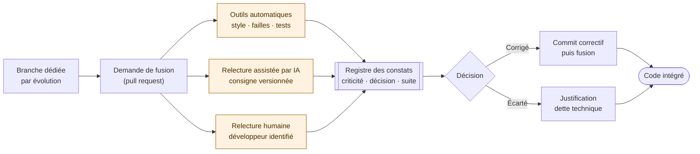

## Le processus de revue de code

```mermaid
flowchart LR
    A["Branche dédiée<br/>par évolution"] --> B["Demande de fusion<br/>(pull request)"]
    B --> C1["Outils automatiques<br/>style · failles · tests"]
    B --> C2["Relecture assistée par IA<br/>consigne versionnée"]
    B --> C3["Relecture humaine<br/>développeur identifié"]
    C1 & C2 & C3 --> D[["Registre des constats<br/>criticité · décision · suite"]]
    D --> E{Décision}
    E -->|Corrigé| F["Commit correctif<br/>puis fusion"]
    E -->|Écarté| G["Justification<br/>dette technique"]
    F --> H(["Code intégré"])
    G --> H

    classDef src fill:#fff2e0,stroke:#9a5c00,color:#4a2d00;
    class C1,C2,C3 src
```
