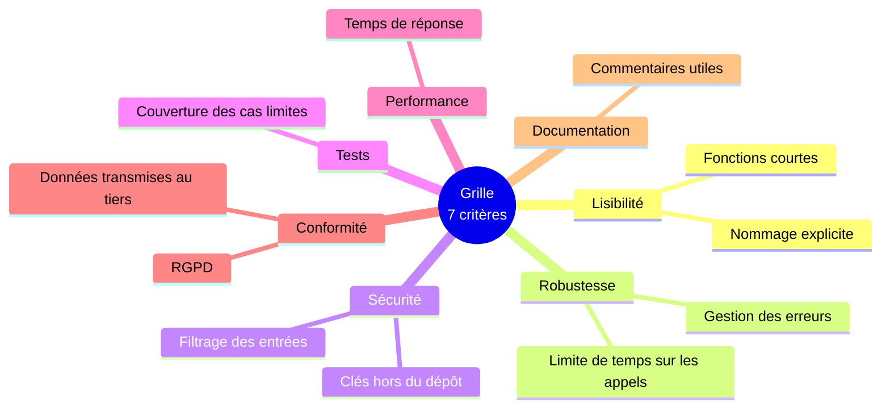

## Grille de relecture

```mermaid
mindmap
  root(("Grille<br/>7 critères"))
    Lisibilité
      Nommage explicite
      Fonctions courtes
    Robustesse
      Gestion des erreurs
      Limite de temps sur les appels
    Sécurité
      Clés hors du dépôt
      Filtrage des entrées
    Tests
      Couverture des cas limites
    Performance
      Temps de réponse
    Conformité
      RGPD
      Données transmises au tiers
    Documentation
      Commentaires utiles
```
