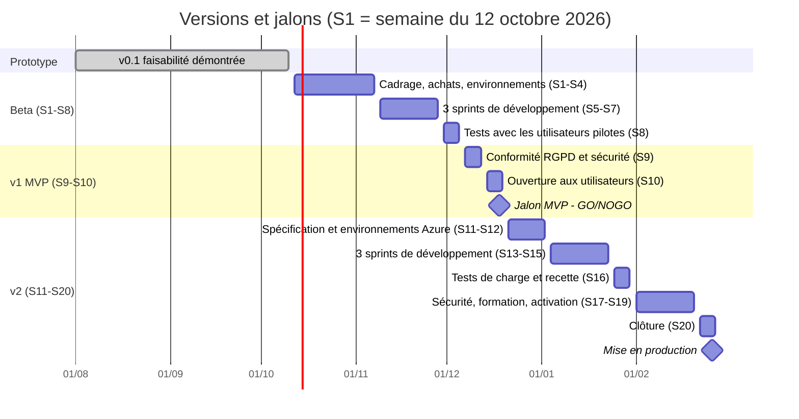

## Plan de release

*Le calendrier suit le planning du projet en 20 semaines (dossier principal, Bloc 3) : S1 commence le 12 octobre 2026, à l'issue du prototype ; la mise en production intervient fin février 2027, dans l'échéance du premier trimestre fixée par le commanditaire.*
