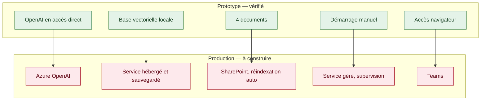

## Écart entre le prototype et l'architecture préconisée

```mermaid
flowchart TB
    subgraph P["Prototype — vérifié"]
        P1[OpenAI en accès direct]
        P2[Base vectorielle locale]
        P3[4 documents]
        P4[Démarrage manuel]
        P5[Accès navigateur]
    end
    subgraph C["Production — à construire"]
        C1[Azure OpenAI]
        C2[Service hébergé et sauvegardé]
        C3[SharePoint, réindexation auto]
        C4[Service géré, supervision]
        C5[Teams]
    end
    P1 --> C1
    P2 --> C2
    P3 --> C3
    P4 --> C4
    P5 --> C5

    classDef proto fill:#e4f3e8,stroke:#1a6b2f,color:#143d1f;
    classDef prod fill:#fde9ec,stroke:#a1001c,color:#5c0010;
    class P1,P2,P3,P4,P5 proto
    class C1,C2,C3,C4,C5 prod
```
