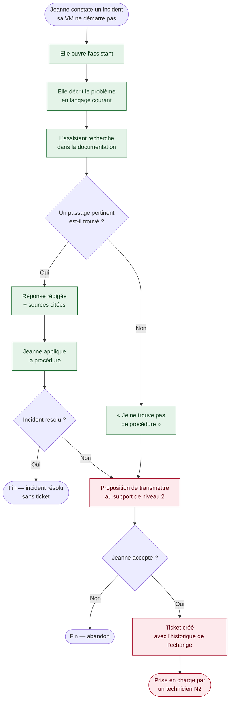

## Parcours 1 — Résolution d'un incident (périmètre du MVP)

Utilisateur type : Jeanne, usage quotidien d'une VM standard.

*En vert : les étapes opérationnelles dans le prototype. En rouge : l'escalade vers le niveau 2, à construire.*
