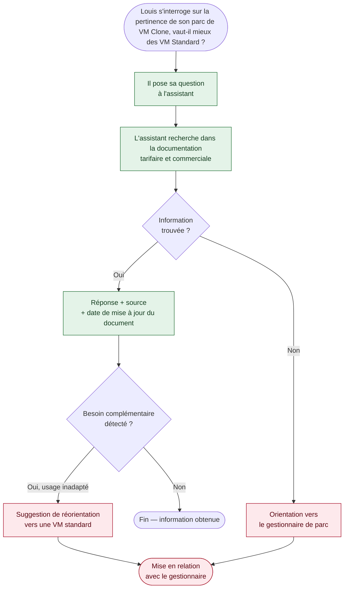

## Parcours 2 — Recherche d'information sur l'offre (v2)

Utilisateur type : Louis, usage occasionnel d'une VM clone.

*Ce parcours n'entre pas dans le MVP : il est ajouté en v2, une fois la résolution d'incident mesurée.*
