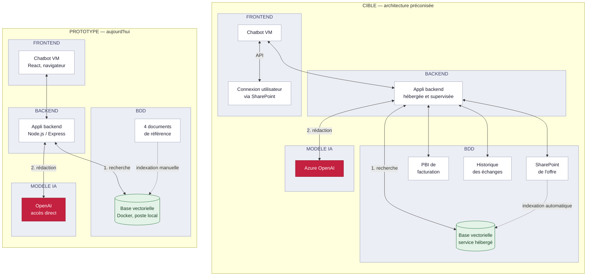

```mermaid
flowchart LR
    subgraph P["PROTOTYPE — aujourd'hui"]
        direction TB
        subgraph PF["FRONTEND"]
            P1["Chatbot VM<br/>React, navigateur"]
        end
        subgraph PB["BACKEND"]
            P2["Appli backend<br/>Node.js / Express"]
        end
        subgraph PD["BDD"]
            direction LR
            P3["4 documents<br/>de référence"]
            P4[("Base vectorielle<br/>Docker, poste local")]
        end
        subgraph PI["MODELE IA"]
            P5["OpenAI<br/>accès direct"]
        end
        P1 <--> P2
        P2 <-->|1. recherche| P4
        P2 <-->|2. rédaction| P5
        P3 -.->|indexation manuelle| P4
    end

    subgraph C["CIBLE — architecture préconisée"]
        direction TB
        subgraph CF["FRONTEND"]
            direction LR
            C1["Chatbot VM"]
            C2["Connexion utilisateur<br/>via SharePoint"]
        end
        subgraph CB["BACKEND"]
            C3["Appli backend<br/>hébergée et supervisée"]
        end
        subgraph CD["BDD"]
            direction LR
            C4["SharePoint<br/>de l'offre"]
            C5["PBI de<br/>facturation"]
            C6["Historique<br/>des échanges"]
            C7[("Base vectorielle<br/>service hébergé")]
        end
        subgraph CI["MODELE IA"]
            C8["Azure OpenAI"]
        end
        C1 <-->|API| C2
        C1 <--> C3
        C3 <--> C4
        C3 <--> C5
        C3 <--> C6
        C3 <-->|1. recherche| C7
        C3 <-->|2. rédaction| C8
        C4 -.->|indexation automatique| C7
    end

    P ~~~ C

    classDef bloc fill:#fff,stroke:#9aa0b5,color:#1a1a2e;
    classDef vect fill:#e4f3e8,stroke:#1a6b2f,color:#143d1f;
    classDef ia fill:#c4203f,stroke:#8f1026,color:#fff;
    classDef couche fill:#eceef5,stroke:#8d95b8,color:#3a4164;
    class P1,P2,P3,C1,C2,C3,C4,C5,C6 bloc
    class P4,C7 vect
    class P5,C8 ia
    class PF,PB,PD,PI,CF,CB,CD,CI couche
```