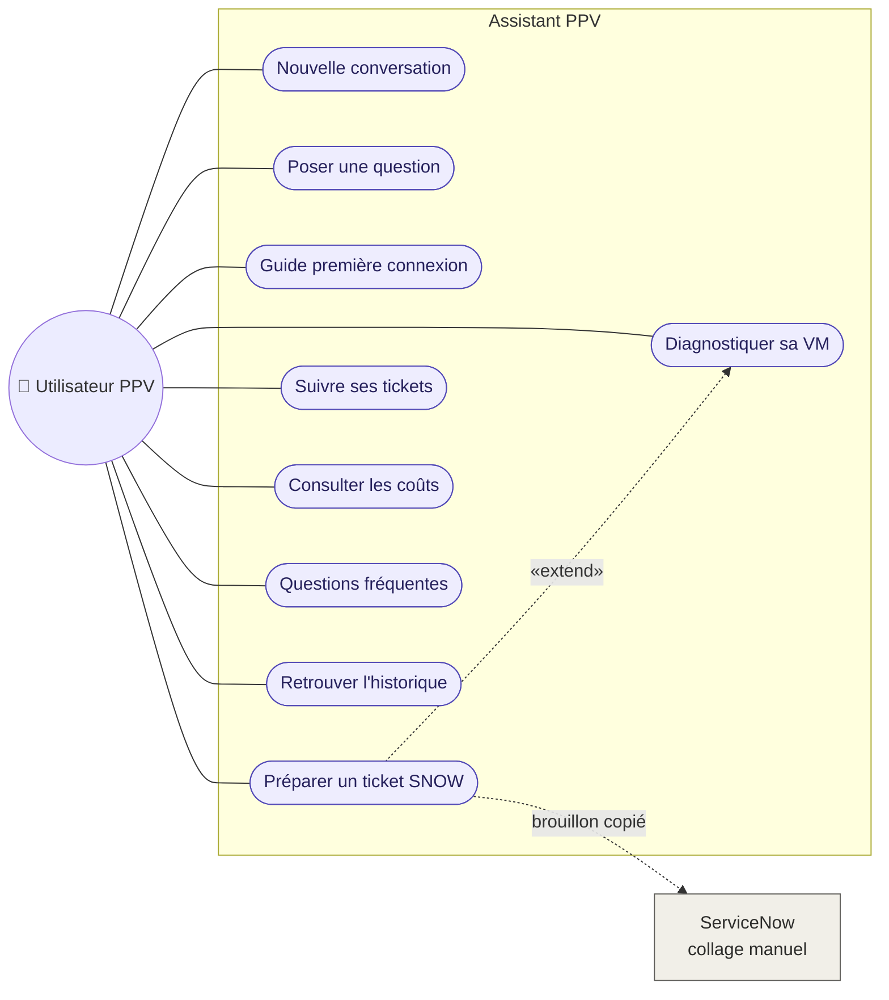

## Diagramme de cas d'utilisation

```mermaid
flowchart LR
    U(("👤 Utilisateur PPV"))

    subgraph S["Assistant PPV"]
        direction TB
        UC1(["Nouvelle conversation"])
        UC2(["Poser une question"])
        UC3(["Guide première connexion"])
        UC4(["Diagnostiquer sa VM"])
        UC5(["Préparer un ticket SNOW"])
        UC6(["Suivre ses tickets"])
        UC7(["Consulter les coûts"])
        UC8(["Questions fréquentes"])
        UC9(["Retrouver l'historique"])
    end

    SN["ServiceNow<br/>collage manuel"]

    U --- UC1 & UC2 & UC3 & UC4 & UC5 & UC6 & UC7 & UC8 & UC9

    UC5 -.->|«extend»| UC4
    UC5 -.->|brouillon copié| SN

    classDef principal fill:#eeedfe,stroke:#534ab7,color:#26215c;
    classDef externe fill:#f1efe8,stroke:#5f5e5a,color:#2c2c2a;
    class UC1,UC2,UC3,UC4,UC5,UC6,UC7,UC8,UC9 principal
    class SN externe
```

*«extend» : action optionnelle, déclenchée seulement si la panne persiste après le diagnostic.*
